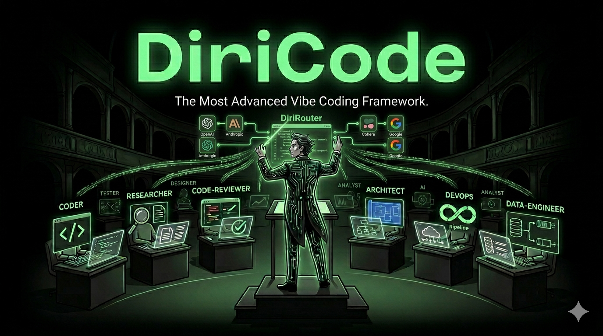
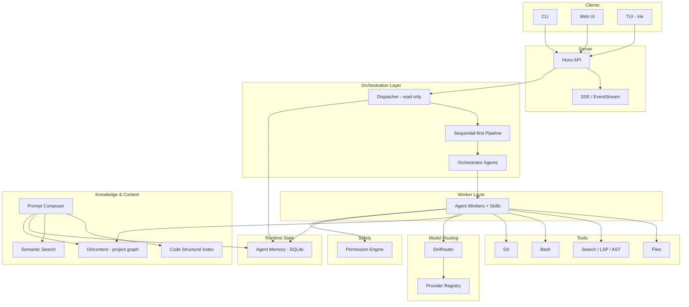

<p align="center">
  
</p>

# DiriCode - The Most Advanced Vibe Coding Framework

[](https://opensource.org/licenses/MIT)
[](https://github.com/radoxtech/diricode/actions)
[](https://nodejs.org/)

DiriCode is a **cost-optimized agentic coding framework** built around a **modular 9-module architecture**: a read-only dispatcher, specialized agent workers, orchestrator coordination, context-aware model routing (DiriRouter), structured project knowledge (Diricontext), safe tools, streamed execution visibility, and resumable checkpoints.

**Why DiriCode?** In the age of expensive API subscriptions, DiriCode helps you:

- 💰 **Save money** by intelligently routing to the cheapest capable model
- 🔄 **Rotate multiple subscriptions** — GitHub Copilot, Azure, Anthropic, Google — maximizing your quota usage
- ⏰ **Optimize hours limits** — never waste API quota, auto-switch when limits hit
- 📊 **Learn which models excel at what** — built-in scoring tracks performance per task type

> **Status: Pre-MVP (v0.0.0)** — core runtime pieces exist, modular architecture established, end-to-end pipeline integration in progress.

---

## Architecture Overview

DiriCode is organized into **9 distinct modules**, each owning a well-defined concern:

| #   | Module                    | Package                                 | Role                                                                                         |
| --- | ------------------------- | --------------------------------------- | -------------------------------------------------------------------------------------------- |
| 0   | **Diricontext**           | `packages/project-planner/`             | Graph-based directed context — project knowledge across 3 namespaces (docs, plan, reference) |
| 1   | **Code Structural Index** | `packages/code-index/` _(planned)_      | Tree-sitter parsing, PageRank file scoring, FTS5 symbol search                               |
| 2   | **Prompt Composer**       | `packages/prompt-composer/` _(planned)_ | 3-layer context management: structural index → condenser pipeline → context composer         |
| 3   | **Semantic Search**       | `packages/semantic-search/` _(planned)_ | Embedding provider abstraction, sqlite-vec storage, hybrid FTS5+vector search                |
| 4   | **Agent Memory**          | `packages/memory/`                      | SQLite-backed session/turn state, ReasoningBank, cross-session querying                      |
| 5   | **DiriRouter**            | `packages/dirirouter/`                  | Context-aware model routing, provider registry, cost tracking, fallback chains               |
| 6a  | **Agent Workers**         | `packages/agents/`                      | Specialized agents that do the work (code-writer, planner, explorer, etc.) + skills          |
| 6b  | **Orchestrators**         | `packages/orchestrators/` _(planned)_   | Dispatcher, delegation, coordination, monitoring — never mutate code directly                |
| 7   | **Permission Engine**     | `packages/core/`                        | Cross-cutting permission handlers, audit logging, granular permission levels                 |

### Design Principles

- **Workers vs Orchestrators**: Workers do the work and receive skills. Orchestrators delegate, coordinate, and monitor. Dependency direction: orchestrator → worker, never reverse.
- **Diricontext ≠ Runtime Context**: Diricontext is a persistent project knowledge graph. Prompt Composer is runtime token budget management. Different systems, different lifecycles.
- **Skills belong with workers**: Skills are AI instruction sets (SKILL.md + frontmatter). Workers execute them; orchestrators decide whom to assign.
- **Tool registration in tools/**: All MCP tool schemas + handlers live in `packages/tools/`. Domain logic is imported from the owning module.



## Key Architectural Decisions

### Dispatcher-first (ADR-002)

The dispatcher remains the orchestrator and stays read-only. It routes, delegates, aggregates, and exposes progress — but should not become a hidden "do everything" agent. With the agents/orchestrators split, dispatching logic lives in `packages/orchestrators/`.

### Pipeline-first, sequential-first (ADR-013)

The long-term shape remains **Interview → Plan → Execute → Verify**, but MVP-1 delivery is:

**Prompt → Dispatcher → Orchestrator → Worker → Tool execution → Response**

with **checkpoint/resume** and **observable progress** required from the start.

### DiriRouter — unified model routing (ADR-055)

Supersedes the earlier "LLM Picker" design (ADR-049). DiriRouter unifies provider routing, model selection, cost tracking, context-aware tier management, and fallback chains in a single package. Context window tiers: LOW (<200k), MEDIUM (200k–800k), HEAVY (>800k).

### Diricontext — structured project knowledge

A graph-based directed context system with 3 namespaces: **docs** (what IS — features, components, ADR decisions), **plan** (what WILL BE — tasks, epics, sprints), **reference** (external context — legacy apps, competitors). Published independently as an MCP server + TypeScript library.

### EventStream as observability backbone (ADR-031)

Observability starts with typed events and replayable runtime data. Richer UI surfaces build on top of that.

### SQLite is runtime truth (ADR-048)

Runtime state lives in SQLite. GitHub is for planning/project visibility, not the runtime source of truth.

## What Exists Today

- **DiriRouter (Model Routing)** — Multi-provider registry (Gemini, Kimi, Zhipu AI, MiniMax, Copilot), context-aware routing with LOW/MEDIUM/HEAVY tiers, cost tracking, fallback chains, and subscription rotation. Playground UI for testing model selection.
- **Dispatcher and delegation protocol** — Read-only dispatcher runtime, parent/child delegation envelopes, context inheritance modes, async job/sandbox primitives
- **Tool layer** — File read/write/edit, grep/glob, bash execution with safety controls, LSP and AST-aware tooling foundations
- **Runtime state and memory** — SQLite-backed repositories (12 repos), task/context persistence
- **Transport and observability** — Hono API routes, SSE transport, event emission foundations
- **Agent workers** — Dispatcher, planner-quick, code-writer, code-explorer, sequential-executor, sandbox, background-task-manager
- **Diricontext** — Designed and specified across 6 implementation waves (#576–#612)

## DiriRouter: Smart Model Routing

DiriRouter is the heart of DiriCode's cost-optimization strategy. Instead of hardcoding models or relying on a single provider, DiriRouter intelligently selects the best model for each task based on context requirements, cost, and availability.

### Multi-Subscription Rotation

Configure multiple subscriptions and let DiriRouter automatically rotate between them:

```jsonc
// .dc/config.jsonc
{
  "subscriptions": [
    {
      "id": "github-copilot",
      "provider": "copilot",
      "priority": 1, // Preferred
      "limits": { "monthlyBudget": 50 },
    },
    {
      "id": "gemini-personal",
      "provider": "gemini",
      "priority": 2,
      "credentials": { "$env": "GEMINI_API_KEY" },
    },
    {
      "id": "kimi-backup",
      "provider": "kimi",
      "priority": 3, // Fallback
    },
  ],
}
```

### Context-Aware Tiers

Models are classified by capability tiers that map to context window requirements:

| Tier       | Context      | Use Case                          | Examples                 |
| ---------- | ------------ | --------------------------------- | ------------------------ |
| **LOW**    | 200k+ tokens | Utility tasks, simple generation  | Gemini Flash, MiniMax M2 |
| **MEDIUM** | 200k–800k    | Standard coding, review, research | Gemini Pro, Kimi 2.5     |
| **HEAVY**  | 800k+        | Complex reasoning, architecture   | Claude Opus, GPT-5       |

### Cost Optimization

- **"Try Cheap First"**: For ambiguous tasks, DiriRouter attempts a LOW-tier model first. If successful, you save money. If not, it escalates to the appropriate tier.
- **Subscription before API**: Prefer subscription quota (Copilot, etc.) before paying per-token
- **Auto-fallback**: When a subscription hits limits, automatically switch to the next available

### Model Scoring (v2+)

Track which models perform best for specific task types:

```typescript
// Elo-based scoring learns from outcomes
{
  "gemini-2.5-pro": { "code-review": 1250, "refactoring": 1180 },
  "claude-opus-4": { "architecture": 1320, "debugging": 1280 }
}
```

Signals: Did code compile? Tests pass? Human thumbs up/down?

## Current Package Layout

```text
apps/
  cli/                    # CLI entry point
packages/
  core/                   # Types, contracts, interfaces + Permission Engine
  agents/                 # Agent Workers (specialized agents + skills)
  orchestrators/          # Orchestrators (planned — dispatcher, coordination)
  tools/                  # MCP tool schemas + handlers
  dirirouter/             # DiriRouter — model routing, providers, cost tracking
  memory/                 # Agent Memory — SQLite session/turn state
  server/                 # Hono API server
  web/                    # Web Dashboard (Vite + React + shadcn/ui)
  project-planner/        # Diricontext — project knowledge graph
  prompt-composer/        # Prompt Composer (planned — context management)
  semantic-search/        # Semantic Search (planned — embeddings + hybrid search)
  code-index/             # Code Structural Index (planned — tree-sitter + PageRank)
  github-mcp/             # GitHub MCP integration
  web-search/             # Web search MCP integration
  test-harness/           # Test harness utilities
  test-utils/             # Test utilities
docs/
  adr/                    # Architecture Decision Records (ADR-001 through ADR-055)
  mvp/                    # MVP epic documentation
  v2/                     # v2 roadmap (hooks, observability, semantic search)
  v3/                     # v3 roadmap (advanced observability, swarm)
```

## Roadmap

### MVP-1 — First Believable Runtime

- Sequential-first execution with explicit turn lifecycle
- Checkpoint/resume as first-class requirement
- Semantic navigation / structural tooling uplift
- Early evented transparency (EventStream)
- Memory-backed runtime state
- DiriRouter basic model selection

### MVP-2 — Core Intelligence + Cost Optimization

- Prompt Composer (3-layer context management)
- Code Structural Index (tree-sitter + PageRank)
- Permission Engine Phase 1
- **DiriRouter cost tracking + subscription rotation** — track spend across providers, auto-rotate when quotas hit
- **Model quality scoring** — learn which models excel at which tasks
- Hook framework (6 MVP hook types)

### v2 — Expansion

- Semantic Search (embeddings + hybrid search)
- Agent Memory extensions (ReasoningBank, cross-session querying)
- Observability v2 (structured metrics, trace correlation)
- Hook framework v2 (approval system, auto-advance)
- Sandbox execution environment
- Advanced UX (TUI via Ink, speech-to-text exploration)

### v3 — Advanced Intelligence

- Observability v3 (distributed tracing, anomaly detection)
- Swarm coordination (bounded parallel execution)
- Advanced orchestration patterns
- **DiriRouter Elo scoring + A/B testing** — data-driven model selection based on historical performance per task type

## Current Status

| Area                        | Status          | Notes                                           |
| --------------------------- | --------------- | ----------------------------------------------- |
| Core runtime / dispatcher   | ✅ Partial-real | Strong runtime foundation exists                |
| Tool layer                  | ✅ Partial-real | File/search/bash/LSP/AST foundations exist      |
| SQLite memory backbone      | ✅ Partial-real | 12 repositories, local-first direction real     |
| SSE / EventStream transport | ✅ Partial-real | Transport exists; full event model in progress  |
| DiriRouter (model routing)  | ✅ Partial-real | Providers, context tiers, fallback chains exist |
| Agent Workers               | ✅ Partial-real | 7 agent definitions exist                       |
| Diricontext                 | 📐 Designed     | 6-wave implementation plan, 32 issues specified |
| Orchestrators               | 📐 Designed     | Split from agents, epic #614 with 18 issues     |
| Prompt Composer             | 📐 Designed     | ADR-016/017, epic #631 with 12 issues           |
| Code Structural Index       | 📐 Designed     | ADR-018, epic #633 with 5 issues                |
| Semantic Search             | 📐 Designed     | ADR-021 addendum, epic #632 with 5 issues       |
| Permission Engine           | 📐 Designed     | ADR-051/052, epic #621 with ~12 issues          |
| End-to-end pipeline         | 🏗️ In progress  | Core integration being wired                    |
| Checkpoint / resume         | 🏗️ In progress  | Explicit MVP-1 requirement                      |
| Hooks framework             | 📐 Designed     | ADR-024, epics #14/#186/#253                    |

## Getting Started

### Prerequisites

- Node.js >= 24
- pnpm >= 9

### Installation

```bash
git clone https://github.com/radoxtech/diricode.git
cd diricode
pnpm install
pnpm build
```

### Development

```bash
pnpm build
pnpm test
pnpm lint
pnpm format
pnpm typecheck
```

## Documentation Index

- **ADRs**: `docs/adr/` — 55 Architecture Decision Records
- **MVP plan**: `docs/mvp/` — epic breakdown and implementation order
- **v2 roadmap**: `docs/v2/` — hooks, observability, semantic search
- **v3 roadmap**: `docs/v3/` — advanced observability, swarm coordination

## Contributing

The project is still in active architectural shaping. If you want to understand the current direction, start with:

1. `docs/adr/adr-002-dispatcher-first-agent-architecture.md` — Dispatcher-first architecture
2. `docs/adr/adr-055-diri-router-unified-package.md` — DiriRouter unified routing
3. `docs/adr/adr-013-project-pipeline.md` — Pipeline design
4. `docs/adr/adr-031-observability-eventstream-agent-tree.md` — Observability
5. `docs/adr/adr-048-sqlite-issue-system.md` — SQLite runtime state
6. `docs/mvp/index.md` — MVP implementation plan

## License

[MIT](LICENSE) © Rado x Tech
