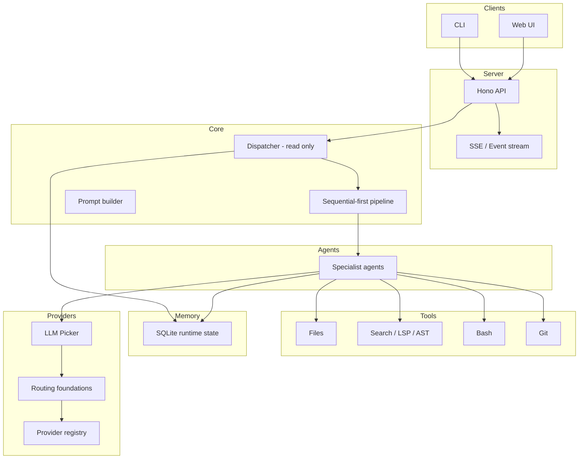

# DiriCode

[](https://opensource.org/licenses/MIT)
[](https://github.com/radoxtech/diricode/actions)
[](https://nodejs.org/)

DiriCode is a local-first agentic coding framework focused on building a **believable working prototype first**: a controlled runtime loop with a read-only dispatcher, specialized agents, safe tools, streamed execution visibility, and resumable checkpoints.

> **Status: Pre-MVP (v0.0.0)** — core runtime pieces exist, but the end-to-end pipeline is still being wired.

---

## Current Direction

The near-term goal is **not** to ship the entire long-range 40-agent vision at once.

The goal is to ship the fastest believable prototype with these properties:

- **Read-only dispatcher** orchestrates work without directly mutating code.
- **Sequential-first runtime** is easier to debug, trust, and resume.
- **Streaming visibility** makes agent/tool progress observable instead of opaque.
- **Checkpoint/resume** is a first-class MVP-1 requirement.
- **Semantic navigation + structural tooling** raise coding quality early.
- **Local SQLite state** keeps runtime operations offline-first and low-latency.

Later capabilities — broader swarm execution, richer approval UX, advanced context autopilot, full ReasoningBank live integration, and **intelligent model selection via the LLM Picker** (ADR-049) — remain in the roadmap, but they are not the first delivery target.

## What Exists Today

These parts are already real in the repository:

- **Dispatcher and delegation protocol**
  - read-only dispatcher runtime
  - parent/child delegation envelopes
  - context inheritance modes
  - async job/sandbox primitives
- **Tool layer**
  - file read/write/edit
  - grep/glob
  - bash execution with safety controls
  - LSP and AST-aware tooling foundations
- **Runtime state and memory**
  - SQLite-backed repositories
  - task/context persistence primitives
  - local-first issue system direction
- **Transport and observability foundations**
  - Hono API routes
  - SSE transport
  - event emission foundations
- **Provider layer**
  - provider registry
  - router foundations
  - model scoring / experiment primitives
  - LLM Picker design (ADR-049)

The biggest remaining gap is **integration**, not “missing ideas.”

## Prototype-First Scope

### First-wave priorities

The current prototype-first rollout is shaped by these patterns:

1. Tool Call Loop
2. Sequential-first execution with later wave compatibility
3. Streaming Tool Calls
4. Tool Loop Error Handling
5. Read-Only Dispatcher
6. Handoff Input Filtering
7. Tool Whitelisting per Agent
8. Semantic Navigation
9. Structural Refactoring support
10. Session Checkpointing / Resume
11. Event Stream Coordination

### Second-wave priorities

After the first runtime path works:

- auto-compact / tool result spill
- sub-agent spawning and stronger autonomy loops
- hash-anchored edits / fuzzier patch application
- lightweight `AGENTS.md` support
- ReasoningBank foundations and cross-session memory querying
- stronger intent gate evolution
- richer router/cost intelligence
- LLM Picker decision engine (ADR-049)

### Later priorities

- full context-budget sophistication
- file guard / AI-slop guards in broader hook framework
- full permission service
- confidence-based multi-agent review
- interactive terminal / TUI

## Architecture



## Key Architectural Decisions

### Dispatcher-first

The dispatcher remains the orchestrator and stays read-only. It routes, delegates, aggregates, and exposes progress — but should not become a hidden “do everything” agent.

See: `docs/adr/adr-002-dispatcher-first-agent-architecture.md`

### Pipeline-first, sequential-first

The long-term shape remains **Interview → Plan → Execute → Verify**, but MVP-1 delivery is clarified as:

**Prompt → Dispatcher → Specialist → Tool execution → Response**

with **checkpoint/resume** and **observable progress** required from the start.

See: `docs/adr/adr-013-project-pipeline.md`

### EventStream as observability backbone

Observability starts with typed events and replayable runtime data. Richer UI surfaces build on top of that.

See: `docs/adr/adr-031-observability-eventstream-agent-tree.md`

### SQLite is runtime truth

Runtime state lives in SQLite. GitHub is for planning/project visibility, not the runtime source of truth.

See: `docs/adr/adr-048-sqlite-issue-system.md`

## MVP Roadmap Shape

### POC

Prove the basic path:

- dispatcher runtime
- safe tools
- provider path
- CLI/server/SSE skeleton

### MVP-1

Ship the first believable runtime:

- sequential-first execution
- explicit turn lifecycle
- heuristic route into execution path
- checkpoint/resume
- semantic navigation / structural tooling uplift
- early evented transparency
- memory-backed runtime state

### MVP-2+

Expand safely:

- richer hooks and guardrails
- stronger autonomy / bounded waves
- smarter context management
- ReasoningBank live integration
- richer observability UI

## Current Package Layout

```text
apps/
  cli/
packages/
  core/
  agents/
  tools/
  providers/
  server/
  memory/
  web/
docs/
  adr/
  mvp/
  v2/
  v3/
  v4/
```

## Current Status

| Area                                | Status          | Notes                                                |
| ----------------------------------- | --------------- | ---------------------------------------------------- |
| Dispatcher / delegation             | ✅ Partial-real | Strong runtime foundation exists                     |
| Tool layer                          | ✅ Partial-real | File/search/bash/LSP/AST foundations exist           |
| SQLite memory backbone              | ✅ Partial-real | Repositories and local-first direction are real      |
| SSE / transport                     | ✅ Partial-real | Transport exists; full event model still in progress |
| Provider layer                      | ✅ Partial-real | Registry exists; richer routing still evolving       |
| LLM Picker                          | 📐 Designed     | ADR-049 accepted; implementation in MVP-2            |
| End-to-end pipeline                 | 🏗️ In progress  | Core integration still being wired                   |
| Checkpoint / resume                 | 🏗️ In progress  | Explicit MVP-1 requirement                           |
| Semantic navigation / refactoring   | 🏗️ In progress  | High-priority prototype multiplier                   |
| Full context budgeting / compaction | 📋 Later        | Deliberately not first-wave                          |
| Full swarm / broad autonomy         | 📋 Later        | Architectural direction kept, delivery delayed       |

## Getting Started

### Prerequisites

- Node.js >= 24
- pnpm >= 9

### Installation

```bash
git clone https://github.com/radoxtech/diricode.git
cd diricode
pnpm install
pnpm build
```

### Development

```bash
pnpm build
pnpm test
pnpm lint
pnpm format
pnpm typecheck
```

## Documentation Index

- ADRs: `docs/adr/`
- MVP plan: `docs/mvp/`
- later roadmap: `docs/v2/`, `docs/v3/`, `docs/v4/`

## Contributing

The project is still in active architectural shaping. If you want to understand the current direction, start with:

1. `docs/adr/adr-002-dispatcher-first-agent-architecture.md`
2. `docs/adr/adr-013-project-pipeline.md`
3. `docs/adr/adr-031-observability-eventstream-agent-tree.md`
4. `docs/adr/adr-048-sqlite-issue-system.md`
5. `docs/mvp/index.md`

## License

[MIT](LICENSE) © Rado x Tech
