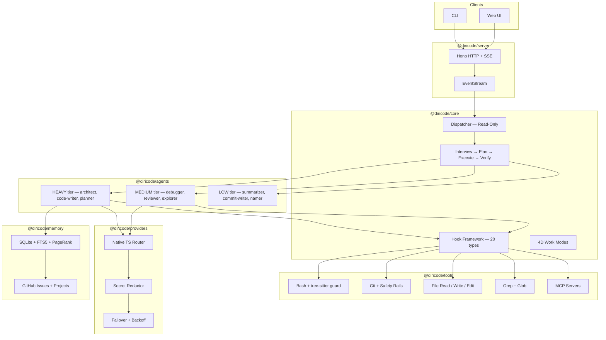

# DiriCode

[](https://opensource.org/licenses/MIT)
[](https://github.com/radoxtech/diricode/actions)
[](https://nodejs.org/)

A multi-agent AI coding framework that uses GitHub Projects as its brain. DiriCode orchestrates 40 specialized agents through a structured pipeline, with safety guarantees that cannot be bypassed — even in full-auto mode.

> **Status: Pre-MVP (v0.0.0)**. Active early development. Core subsystems are functional, but the full pipeline is not yet wired end-to-end. Not ready for production use.

---

## Why DiriCode

Most AI coding tools store their state in hidden local files and treat project management as an afterthought. DiriCode takes a different approach:

- **GitHub Projects as the backend.** Plans, tasks, and progress live in GitHub Issues and Projects — not buried in `.hidden/` directories. You can review agent work from your phone, assign tasks on the go, and multiple sessions can work concurrently without merge conflicts on state files.
- **Dispatcher-first architecture.** A read-only orchestrator routes tasks to specialized agents. The dispatcher never writes code — it delegates to the right agent for the job, keeping context clean and responsibilities separated.
- **Safety that cannot be turned off.** Bash commands are parsed into ASTs via tree-sitter before execution. Git safety rails block destructive operations. Secrets are redacted before reaching any LLM. These protections are mandatory across all autonomy levels.
- **40 agents across 3 tiers.** Not one monolithic agent trying to do everything. Specialized agents for code writing, reviewing, planning, debugging, testing, and research — each assigned to the right model tier (HEAVY/MEDIUM/LOW) for cost efficiency.

## Architecture



Architecture decisions are documented in [41 ADRs](docs/adr/).

## Key Design Decisions

### GitHub Issues as State Backend

DiriCode stores plans, requirements, and task progress in GitHub Issues and Projects. SQLite serves as a local cache with FTS5 full-text search and a timeline of events. This separation means:

- Your project management data lives where your code lives
- Mobile access via the GitHub app
- Concurrent sessions without state file conflicts
- Future backends planned: GitLab Issues, Jira, local-only mode

See [ADR-022](docs/adr/adr-022-github-issues-sqlite-timeline.md).

### 4-Dimension Work Modes

Instead of a binary "safe vs yolo" toggle, DiriCode uses four independent dimensions:

| Dimension      | Range | Low end          | High end           |
| -------------- | ----- | ---------------- | ------------------ |
| **Quality**    | 1-5   | Cheap/fast (POC) | Production-grade   |
| **Autonomy**   | 1-5   | Ask everything   | Full auto          |
| **Verbosity**  | 1-4   | Silent           | Narrated           |
| **Creativity** | 1-5   | Reactive/minimal | Proactive/creative |

Quality controls which model tier agents use. Autonomy controls how much human approval is needed. These are independent — you can run full-auto at POC quality, or ask-everything at production quality.

See [ADR-012](docs/adr/adr-012-4-dimension-work-mode-system.md).

### Pipeline Execution

Non-trivial tasks move through four stages:

1. **Interview** — Clarify requirements, resolve ambiguity
2. **Plan** — Break work into subtasks, assign agents, select relevant files
3. **Execute** — Agents work in waves with hook-based safety checks
4. **Verify** — Automated review, test runs, lint checks

See [ADR-013](docs/adr/adr-013-project-pipeline.md).

### Agent Roster — 40 Agents, 3 Tiers

Agents are grouped into 6 categories across 3 cost tiers:

| Category               | Example agents                                       |
| ---------------------- | ---------------------------------------------------- |
| Command & Control      | dispatcher, auto-continue                            |
| Strategy & Planning    | architect, planner-thorough, planner-quick           |
| Code Production        | code-writer, code-writer-hard, debugger, test-writer |
| Quality Assurance      | code-reviewer-thorough, verifier, risk-assessor      |
| Research & Exploration | code-explorer, web-researcher, browser-agent         |
| Utility                | commit-writer, namer, summarizer, git-operator       |

HEAVY agents run on the best available models (e.g., Sonnet, GPT-4o). LOW agents run on cheap, fast models. The dispatcher selects agents dynamically via `search_agents()` rather than a hardcoded list.

See [ADR-004](docs/adr/adr-004-agent-roster-3-tiers.md) and [ADR-040](docs/adr/adr-040-tool-based-agent-discovery.md).

### Safety Architecture

Three layers of protection that are always on:

- **Tree-sitter Bash parsing** — Commands are parsed into ASTs, not matched with regex. Detects destructive patterns (`rm -rf /`, pipes to `sh`, fork bombs) before execution. See [ADR-029](docs/adr/adr-029-treesitter-bash-parsing.md).
- **Git safety rails** — Blocks `git add .` without review, requires confirmation for `--force` and `reset --hard`, respects branch protection. Cannot be disabled, even in Autonomy level 5. See [ADR-027](docs/adr/adr-027-git-safety-rails.md).
- **Secret redaction** — Scans for API keys, tokens, and credentials before any data is sent to LLM providers. See [ADR-028](docs/adr/adr-028-secret-redaction.md).

Tool actions are categorized as Safe, Risky, or Destructive. Safe actions run automatically. Risky actions require one-time approval per session. Destructive actions always ask. See [ADR-014](docs/adr/adr-014-smart-hybrid-approval.md).

### Hook Framework

20 hook types across lifecycle, safety, pipeline, and context categories. Hooks use two execution models:

- **Interceptors** (FIFO/LIFO) — Sequential state modification (e.g., `session-start`, `post-commit`)
- **Wrappers** (nested/onion) — Control flow, retries, safety (e.g., `pre-commit`, `pre-tool-use`)

Hooks can be implemented in TypeScript or as external scripts (Python, bash). See [ADR-024](docs/adr/adr-024-hook-framework-20-types.md) and [ADR-033](docs/adr/adr-033-interceptor-wrapper-hook-split.md).

### Context Management

A 3-layer system designed to keep agents under 50% of their context window:

1. **Structural Index** — SQLite + Tree-sitter + PageRank ranks files by importance
2. **Condenser Pipeline** — 3-stage compression: file-read dedup, observation masking, conversation summary
3. **Context Composer** — Adaptive token budgets (50% active files, 20% history, 15% tools, 15% system)

The architect agent selects specific files per subtask rather than sending the entire codebase. See [ADR-016](docs/adr/adr-016-3-layer-context-management.md).

### Skills and MCP

Custom agents and skills can be defined via `SKILL.md` files (compatible with [agentskills.io](https://agentskills.io) format). Skills shadow in order: personal > workspace > family defaults.

DiriCode integrates with [Model Context Protocol](https://modelcontextprotocol.io/) servers for tool interoperability, including zero-API-key web search and Playwright-based browser automation. See [ADR-008](docs/adr/adr-008-skill-system-agentskills-io.md) and [ADR-030](docs/adr/adr-030-mcp-capabilities.md).

### Configuration

JSONC config files loaded via [c12](https://github.com/unjs/c12) with a 4-layer hierarchy:

```
CLI flags / DC_* env vars  →  Project .dc/  →  Global ~/.config/dc/  →  Defaults
```

All config is validated with Zod schemas. See [ADR-009](docs/adr/adr-009-jsonc-config-c12-loader.md) and [ADR-011](docs/adr/adr-011-4-layer-config-hierarchy.md).

## Project Structure

```text
apps/
  cli/              CLI entrypoint (dc / diricode commands)
packages/
  core/             Agent interfaces, config schema (Zod), tool types
  agents/           Dispatcher agent and registry
  tools/            File ops, grep, glob, bash execution with safety filter
  providers/        Multi-LLM provider interface and registry
  server/           Hono HTTP server with REST API + SSE transport
  memory/           SQLite database with FTS5 search
  web/              Web UI (planned — Vite + React + shadcn/ui)
docs/
  adr/              41 Architecture Decision Records
  mvp/              MVP epic specifications
```

## Status

| Component        | Status     | Details                                              |
| ---------------- | ---------- | ---------------------------------------------------- |
| Dispatcher Agent | ✅ Done    | Read-only orchestrator with dynamic agent discovery  |
| Tool Suite       | ✅ Done    | Bash (tree-sitter), file read/write/edit, grep, glob |
| Provider Layer   | ✅ Done    | Unified LLM interface with failover chain            |
| CLI              | ✅ Done    | REPL and one-shot modes with flag parsing            |
| Memory           | ✅ Done    | SQLite + FTS5 persistence layer                      |
| HTTP + SSE       | ✅ Done    | Hono server with SSE event transport                 |
| CI               | ✅ Done    | GitHub Actions with Turborepo caching                |
| Pipeline         | 🏗️ WIP     | Interview → Plan → Execute → Verify                  |
| Hook Framework   | 🏗️ WIP     | 20 hook types (interceptors + wrappers)              |
| Agent Roster     | 🏗️ WIP     | 40 agents planned, dispatcher operational            |
| Context Manager  | 🏗️ WIP     | 3-layer system with PageRank indexing                |
| Secret Redaction | ⏳ Planned | Pattern-based masking before LLM dispatch            |
| Config System    | ⏳ Planned | JSONC + c12, 4-layer hierarchy                       |
| Skill System     | ⏳ Planned | SKILL.md definitions, agentskills.io compatibility   |
| Web UI           | ⏳ Planned | Agent tree, event stream, metrics dashboard          |

## Getting Started

### Prerequisites

- Node.js >= 20
- pnpm >= 9

### Installation

```bash
git clone https://github.com/radoxtech/diricode.git
cd diricode
pnpm install
pnpm build
```

### Running the CLI

```bash
# Interactive REPL
pnpm --filter @diricode/cli dev

# One-shot prompt
pnpm --filter @diricode/cli dev run "your prompt here"

# See all options
pnpm --filter @diricode/cli dev -- --help
```

## Development

Built with [Turborepo](https://turbo.build/) and [Vitest](https://vitest.dev/).

```bash
pnpm build          # Build all packages
pnpm test           # Run tests
pnpm lint           # Lint all packages
pnpm format         # Format with Prettier
pnpm typecheck      # TypeScript type checking
```

## Contributing

DiriCode is in early development. Contributions are welcome.

A `CONTRIBUTING.md` is coming soon. Start by reading the [Architecture Decision Records](docs/adr/) to understand the design philosophy.

## License

[MIT](LICENSE) © Rado x Tech
