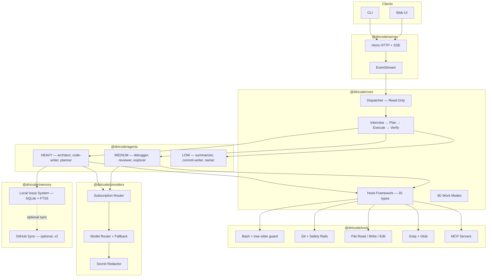
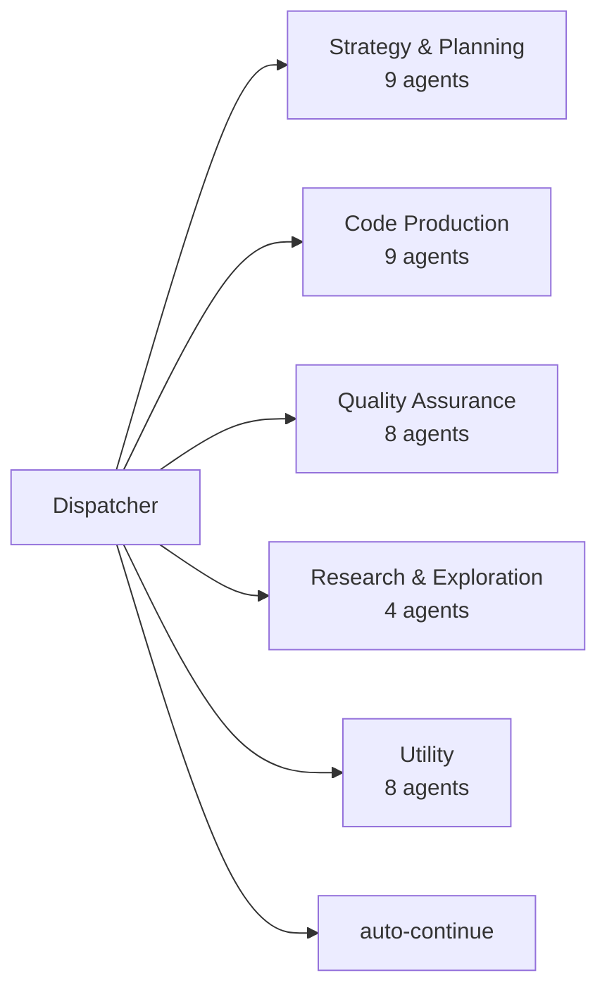
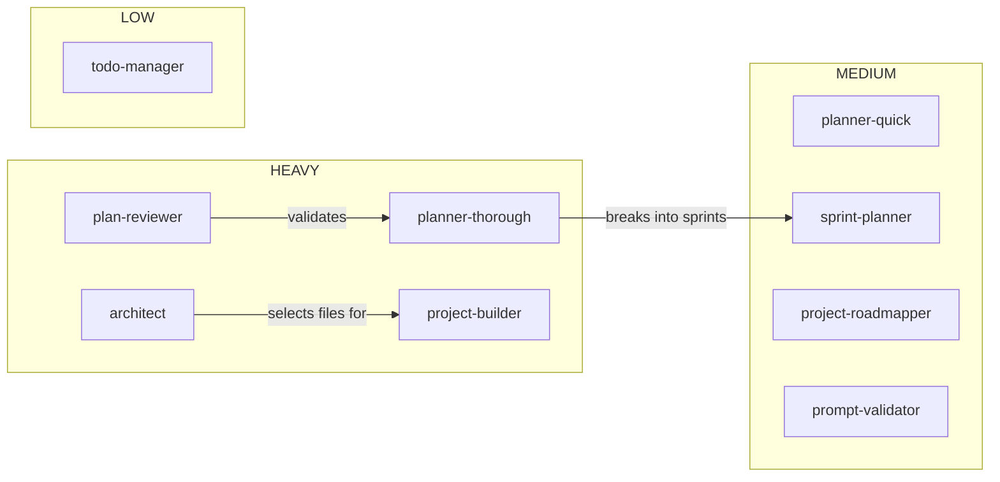
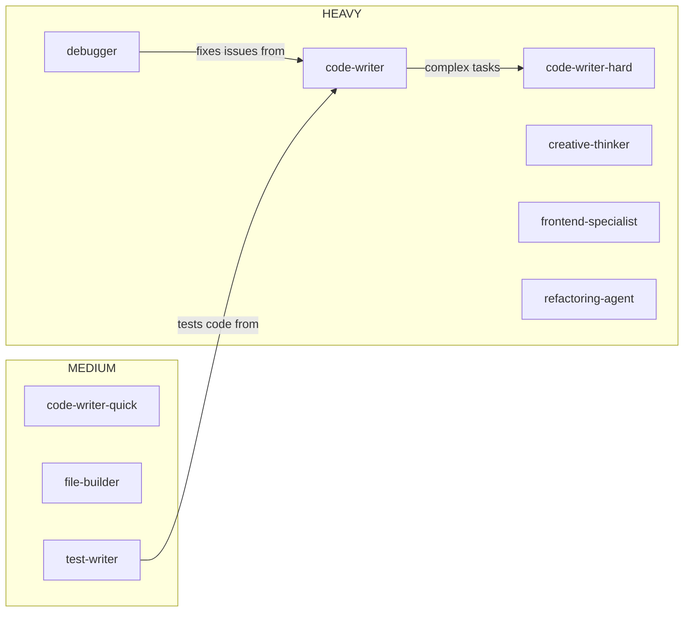
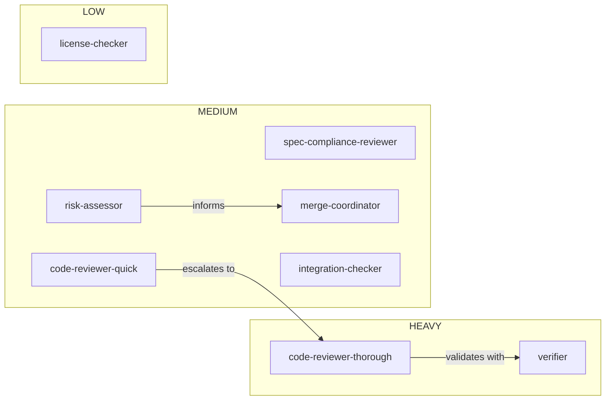
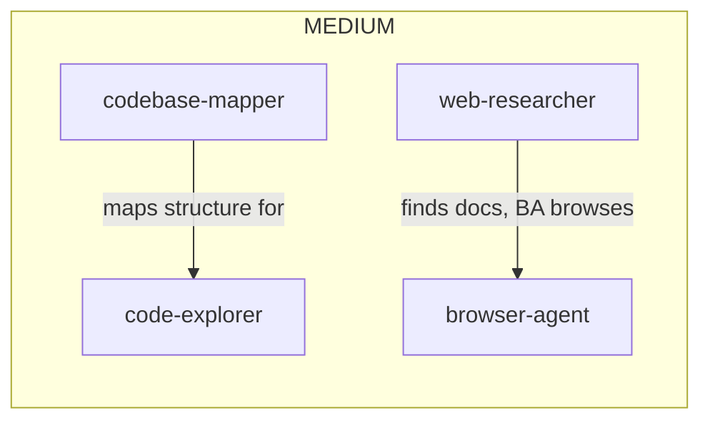
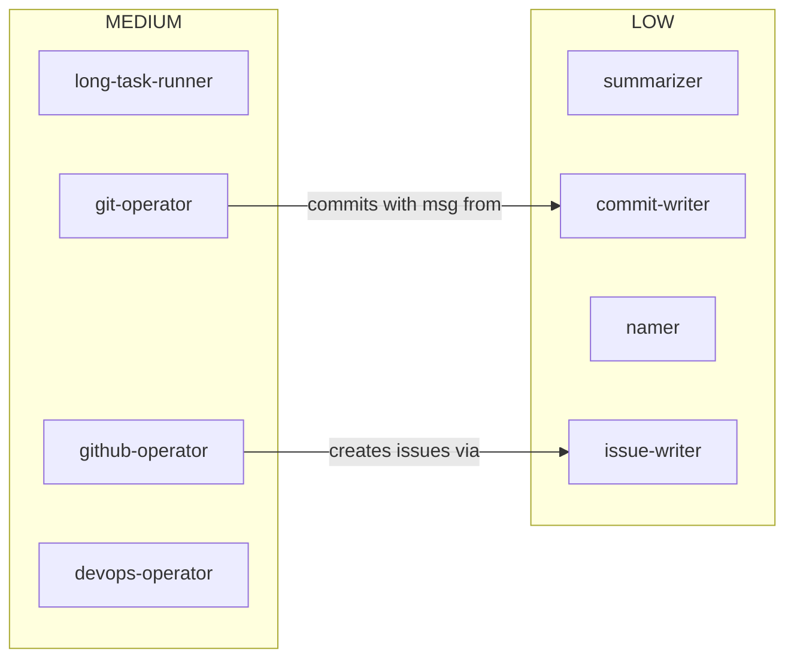

# DiriCode

[](https://opensource.org/licenses/MIT)
[](https://github.com/radoxtech/diricode/actions)
[](https://nodejs.org/)

An autonomous AI coding framework that helps you build applications — from POC to production — using a team of 40 specialized AI agents and LLM thought API. Whether you're a developer, product manager, or product owner, you describe what you want to build, and DiriCode interviews you, challenges your assumptions, builds a detailed plan, and implements it maximally autonomously. Questions are queued by importance and blocking-factor — the orchestrator gathers decision-making questions and doubts into a priority queue, sorted by how much they block other tasks, and you can answer them in batches from your mobile when you have time. All runtime state lives in a local SQLite database, so agents work at full speed with full autonomy, and you can review progress from your phone.

> **Status: Pre-MVP (v0.0.0)**. Active early development. Core subsystems are functional, but the full pipeline is not yet wired end-to-end.

---

## What Makes DiriCode Different

Most AI coding tools are glorified chatbots — you type, they respond, state disappears. DiriCode is designed to work more like an autonomous development team:

- **SQLite is the brain.** Plans, sprints, tasks, and progress live in a local SQLite database — autonomous, no rate limits. Agents read and write state at sub-millisecond speed. GitHub sync is optional: when you want external visibility, a sync adapter pushes state out to a GitHub Project. Agents operate with full autonomy — decisions are local, state is instant.

- **Sprint-based execution.** DiriCode doesn't just answer one question at a time. It interviews you to understand the full scope, builds a plan broken into sprints and epics, then executes tasks in parallel across isolated git worktrees. When it hits a blocker, it finishes everything else it can, does a project review, and replans. It only asks you questions when it genuinely gets stuck or when a decision requires your taste. Questions are queued by importance × blocking-factor — answered from mobile in batches when you have time.

- **Continuous progress reports.** While agents work, you receive real-time reports. If you have time, you can read them and guide the work. If you don't, agents keep going autonomously. You're never blocked, and neither are they.

- **40 specialized agents, not one do-everything bot.** There's an architect, a debugger, a test writer, a code reviewer, a frontend specialist, a web researcher — each one assigned to the right AI model for its job. A read-only dispatcher orchestrates them without ever writing code itself.

- **Safety you can't turn off.** Every bash command is parsed into an AST by tree-sitter before execution. Git operations go through mandatory safety rails. Secrets are automatically redacted before reaching any AI model. These protections are always on — even at maximum autonomy.

## The Vision

DiriCode is being built toward a future where you describe what you want to build, and an autonomous orchestrator turns that into a working product — running sprints, managing its own backlog, and asking for your input only when it matters. Here's how the pieces fit together:

### How It Works (End-to-End Flow)

```
You describe what you want
        ↓
    Interview Phase — DiriCode asks clarifying questions
        ↓
    Planning Phase — breaks work into sprints, epics, and tasks (stored in local SQLite)
        ↓
    Execution Phase — agents work in parallel across git worktrees
        ↓
    ┌── Agent hits a blocker? → parks it, continues other tasks
    ├── Agent encounters decision/doubt → adds to priority queue
    │   └── Queue sorted by: importance × blocking-factor
    ├── Time to ask? → batched questions sent to you (mobile-friendly)
    │   └── You answer when convenient — never blocks agents
    └── All tasks done in this sprint? → runs verification
        ↓
    Verify Phase — automated review, tests, lint checks
        ↓
    Sprint Review — evaluates progress, replans, starts next sprint
        ↓
    You review from the web UI (or optional GitHub sync), approve PRs, give feedback
```

**Questions Queue:** The orchestrator continuously gathers decision-making questions and doubts. Each is tagged with importance (architectural impact, user experience, technical debt) and blocking-factor (how many other tasks it halts). Queue is sorted automatically — highest impact blockers surface first. You receive batched notifications on mobile and answer when ready. Agents never wait on you unless truly blocked.

### Three-Dimensional Model Selection

Instead of hardcoding "use GPT for everything," DiriCode classifies AI models along three dimensions:

**Tier** — how powerful (and expensive) the model is:

| Tier   | Used For                                         | Examples                               |
| ------ | ------------------------------------------------ | -------------------------------------- |
| HEAVY  | Architecture, complex reasoning, thorough review | Opus 4.6, GPT-5.4, Gemini 3.1 Pro      |
| MEDIUM | Standard coding, quick review, debugging         | Sonnet 4.6, Kimi 2.5, Qwen3 Coder Next |
| LOW    | Commit messages, naming, summaries               | Haiku 4.5, DeepSeek V3.2               |

**Family** — what the model is good at:

| Family       | Strength                                         |
| ------------ | ------------------------------------------------ |
| Reasoning    | Complex logic, math, architecture decisions      |
| Creative     | Brainstorming, unconventional solutions, writing |
| UI/UX        | Frontend code, styling, design systems           |
| Speed        | Low latency responses, high throughput           |
| Web Research | Searching, browsing, information gathering       |
| Bulk         | High volume work at minimal cost                 |
| Agentic      | Tool use, multi-step autonomous execution        |

**Context Size** — how much input context the model can handle:

| Context Group | Range          | Used For                                            |
| ------------- | -------------- | --------------------------------------------------- |
| Standard      | ≤200K tokens   | Most tasks, single-file analysis, standard coding   |
| Extended      | 200K–1M tokens | Large codebases, multi-file analysis, big documents |
| Massive       | ≥1M tokens     | Full-repo analysis, massive document processing     |

The same model can appear in different context groups depending on your subscription — for example, Claude Opus via GitHub Copilot (200K, standard) vs Anthropic direct API (1M, massive). The router prefers cheaper subscriptions when smaller context is sufficient.

Each agent requests `{ tier: "heavy", family: "reasoning" }` (and optionally `contextRequired: "standard"`) and the router finds the best available model across all your subscriptions, preferring cheaper subscriptions when smaller context is sufficient. A single model can belong to multiple families — Opus 4.6 is reasoning + creative + agentic.

See [ADR-004](docs/adr/adr-004-agent-roster-3-tiers.md) and [ADR-042](docs/adr/adr-042-multi-subscription-management.md). The 3D classification system is documented in the [ADR-042 addendum](docs/adr/adr-042-multi-subscription-management.md).

### Multi-Subscription Management

You probably have more than one AI subscription — maybe an Anthropic API key, an Azure OpenAI account through work, a GitHub Copilot plan, and a free-tier Google AI key. DiriCode uses all of them simultaneously:

- **Automatic rotation.** When one subscription hits its rate limit, requests immediately route to the next available subscription that offers an equivalent model.
- **Auto-recovery.** When a rate limit resets, that subscription automatically rejoins the rotation pool.
- **Cost awareness.** The router prefers cheaper subscriptions when model quality is equivalent.
- **Budget caps.** Set monthly spending limits per subscription. The system respects them.

**Planned (v2):** Quality scoring — track which models produce the best results for which tasks, using Elo-style ratings built from automated signals (did the code compile? did tests pass?) and optional human feedback.

**Planned (v3):** A/B testing — run structured experiments comparing models on identical tasks to make data-driven decisions about which models to use where.

See [ADR-042](docs/adr/adr-042-multi-subscription-management.md).

### Observability — See Everything

DiriCode treats transparency as a core feature, not an afterthought:

- **Agent tree.** A live hierarchical view showing which agents are running, who spawned whom, what each one is doing right now, and how many tokens they've used.
- **Metrics bar.** Real-time token count, cost, elapsed time, and which model is active — always visible.
- **Live activity indicator.** See exactly what the current agent is doing: reading a file, calling a model, running a test.
- **Continuous reports.** Agents push progress updates as they work. If you're watching, you can steer. If you're not, they keep going.

**Planned (v2):** Click any agent in the tree to see its full conversation, tool calls, and token breakdown. Timeline/waterfall view showing parallel execution branches.

**Planned (v3):** Cost analytics dashboard, performance profiling, model comparison views.

See [ADR-031](docs/adr/adr-031-observability-eventstream-agent-tree.md).

### Local-First Issue System

This is DiriCode's most unconventional design choice. Agents are autonomous runtimes — their task state is operational data, not project metadata. Storing operational data in a remote API introduces rate limits, latency, and blocks autonomous execution. DiriCode keeps all state local for maximum autonomy and speed.

SQLite is the source of truth for all runtime state — issues, tasks, epics, and their relationships. This is a full reversal from the original design (see [ADR-022](docs/adr/adr-022-github-issues-sqlite-timeline.md), superseded by [ADR-048](docs/adr/adr-048-sqlite-issue-system.md)):

- **Plans become local records.** Each sprint task is stored in SQLite with acceptance criteria, file lists, and implementation notes. Local I/O at sub-millisecond speed enables full autonomous execution.
- **Autonomous-first.** Agents work at full capability continuously. Creating an issue, updating task status, marking completion — all local I/O with full autonomy.
- **No rate limits.** Dense agent activity during sprint execution no longer creates API pressure. SQLite reads are sub-millisecond; GitHub API calls have hundreds of milliseconds of round-trip latency.
- **Sync adapters are output targets, not input sources.** If you want external visibility — for stakeholders, phone review, or team collaboration — a sync adapter pushes state from SQLite to a GitHub Project. The directionality is intentional: SQLite receives writes, GitHub receives exports.

MVP ships with no sync adapters. v2 adds the GitHub sync adapter. v3/v4 add GitLab and Jira.

See [ADR-048](docs/adr/adr-048-sqlite-issue-system.md).

## Architecture



Architecture decisions are documented in [48 ADRs](docs/adr/).

## Key Design Decisions

### 4-Dimension Work Modes

Instead of a binary "safe vs yolo" toggle, DiriCode uses four independent dimensions you can tune:

| Dimension      | Range | Low end          | High end           |
| -------------- | ----- | ---------------- | ------------------ |
| **Quality**    | 1-5   | Cheap/fast (POC) | Production-grade   |
| **Autonomy**   | 1-5   | Ask everything   | Full auto          |
| **Verbosity**  | 1-4   | Silent           | Narrated           |
| **Creativity** | 1-5   | Reactive/minimal | Proactive/creative |

Quality controls which model tier agents use. Autonomy controls how much human approval is needed. These are independent — you can run full-auto at POC quality for rapid prototyping, or ask-everything at production quality for critical systems.

See [ADR-012](docs/adr/adr-012-4-dimension-work-mode-system.md).

### Agent Roster — 40 Agents, 6 Categories

The dispatcher selects agents dynamically via `search_agents()` — it searches by capability tags, not a hardcoded list.



#### Phase 1 MVP — 8 Agents Shipping First

Phase 1 ships the minimum viable set for the Interview → Plan → Execute → Verify pipeline:

| Agent                  | Tier   | Role                             |
| ---------------------- | ------ | -------------------------------- |
| dispatcher             | HEAVY  | Orchestrates all agent execution |
| planner-thorough       | HEAVY  | Builds detailed execution plans  |
| architect              | HEAVY  | Selects files per subtask        |
| code-writer            | HEAVY  | Primary implementation agent     |
| code-explorer          | MEDIUM | Codebase navigation and search   |
| code-reviewer-thorough | HEAVY  | Quality gate before merge        |
| git-operator           | MEDIUM | Git operations with safety rails |
| issue-writer           | LOW    | Creates and manages issues       |

The full 40-agent roster is the vision. Additional agents are activated as the pipeline matures and new capabilities (swarm coordination, A/B testing) require them. See [ADR-046](docs/adr/adr-046-swarm-coordination.md).

<details open>
<summary><b>Strategy & Planning</b> — 9 agents</summary>



</details>

<details open>
<summary><b>Code Production</b> — 9 agents</summary>



</details>

<details open>
<summary><b>Quality Assurance</b> — 8 agents</summary>



</details>

<details open>
<summary><b>Research & Exploration</b> — 4 agents</summary>



</details>

<details open>
<summary><b>Utility</b> — 8 agents</summary>



</details>

See [ADR-004](docs/adr/adr-004-agent-roster-3-tiers.md) and [ADR-040](docs/adr/adr-040-tool-based-agent-discovery.md).

### Safety Architecture

Three layers of protection that are always on, even at Autonomy level 5:

- **Tree-sitter Bash parsing.** Commands are parsed into ASTs before execution. Detects `rm -rf /`, pipes to `sh`, fork bombs — not with regex, but with a real parser. See [ADR-029](docs/adr/adr-029-treesitter-bash-parsing.md).
- **Git safety rails.** Blocks `git add .` without review, requires confirmation for `--force` and `reset --hard`. Cannot be disabled. See [ADR-027](docs/adr/adr-027-git-safety-rails.md).
- **Secret redaction.** Scans for API keys, tokens, and credentials before any data reaches an AI model. See [ADR-028](docs/adr/adr-028-secret-redaction.md).

Tool actions are categorized as Safe, Risky, or Destructive — each with different approval requirements. See [ADR-014](docs/adr/adr-014-smart-hybrid-approval.md).

Governance policies (file naming, import style, test coverage thresholds) can be declared in `.dc/policies/` YAML files and enforced via the policy engine. See [ADR-047](docs/adr/adr-047-governance-policy-engine.md).

### Hook Framework

20 hook types across lifecycle, safety, pipeline, and context categories. Two execution models:

- **Interceptors** — Sequential state modification (e.g., `session-start`, `post-commit`)
- **Wrappers** — Control flow, retries, safety (e.g., `pre-commit`, `pre-tool-use`)

Hooks can be TypeScript or external scripts (Python, bash). See [ADR-024](docs/adr/adr-024-hook-framework-20-types.md).

### Context Management

A 3-layer system that keeps agents under 50% of their context window:

1. **Structural Index** — SQLite + Tree-sitter + PageRank ranks files by importance
2. **Condenser Pipeline** — 3-stage compression: dedup, masking, summarization
3. **Context Composer** — Adaptive token budgets per category (files, history, tools, system)

The architect agent picks specific files per subtask rather than dumping the whole codebase. See [ADR-016](docs/adr/adr-016-3-layer-context-management.md).

Successful reasoning patterns are captured and stored in the ReasoningBank — a structured SQLite store that surfaces relevant prior approaches when agents tackle similar problems. See [ADR-045](docs/adr/adr-045-reasoningbank.md).

### Skills and MCP

Custom agents and skills via `SKILL.md` files (compatible with [agentskills.io](https://agentskills.io)). Integration with [Model Context Protocol](https://modelcontextprotocol.io/) servers for web search (zero API keys required) and Playwright browser automation.

See [ADR-008](docs/adr/adr-008-skill-system-agentskills-io.md) and [ADR-041](docs/adr/adr-041-mcp-web-research-servers.md).

### Configuration

JSONC config via [c12](https://github.com/unjs/c12) with a 4-layer hierarchy:

```
CLI flags / DC_* env vars  →  Project .dc/  →  Global ~/.config/dc/  →  Defaults
```

All config validated with Zod schemas. See [ADR-009](docs/adr/adr-009-jsonc-config-c12-loader.md).

## Project Structure

```text
apps/
  cli/              CLI entrypoint (dc / diricode commands)
packages/
  core/             Agent interfaces, config schema (Zod), tool types
  agents/           Dispatcher agent and registry
  tools/            File ops, grep, glob, bash execution with safety filter
  providers/        Multi-LLM provider interface and registry
  server/           Hono HTTP server with REST API + SSE transport
  memory/           SQLite database with FTS5 search and local issue system
  web/              Web UI (planned — Vite + React + shadcn/ui)
docs/
  adr/              48 Architecture Decision Records
  mvp/              MVP epic specifications
```

## Status

| Component           | Status     | Details                                              |
| ------------------- | ---------- | ---------------------------------------------------- |
| Dispatcher Agent    | ✅ Done    | Read-only orchestrator with dynamic agent discovery  |
| Tool Suite          | ✅ Done    | Bash (tree-sitter), file read/write/edit, grep, glob |
| Provider Layer      | ✅ Done    | Unified LLM interface with failover chain            |
| CLI                 | ✅ Done    | REPL and one-shot modes with flag parsing            |
| Memory              | ✅ Done    | SQLite + FTS5 persistence layer                      |
| HTTP + SSE          | ✅ Done    | Hono server with SSE event transport                 |
| CI                  | ✅ Done    | GitHub Actions with Turborepo caching                |
| Pipeline            | 🏗️ WIP     | Interview → Plan → Execute → Verify                  |
| Hook Framework      | 🏗️ WIP     | 20 hook types (interceptors + wrappers)              |
| Agent Roster        | 🏗️ WIP     | 40 agents planned, 8 shipping in Phase 1             |
| Context Manager     | 🏗️ WIP     | 3-layer system with PageRank indexing                |
| Local Issue System  | 🏗️ WIP     | SQLite-native issues/tasks/epics (ADR-048)           |
| Secret Redaction    | ⏳ Planned | Pattern-based masking before LLM dispatch            |
| Config System       | ⏳ Planned | JSONC + c12, 4-layer hierarchy                       |
| Skill System        | ⏳ Planned | SKILL.md definitions, agentskills.io compatibility   |
| Subscription Router | ⏳ Planned | Multi-subscription rotation + health tracking        |
| Web UI              | ⏳ Planned | Agent tree, event stream, metrics dashboard          |
| GitHub Sync Adapter | 📋 v2      | Optional push from SQLite to GitHub Project          |
| Quality Scoring     | 📋 v2      | Elo-based model quality tracking                     |
| A/B Testing         | 📋 v3      | Structured model comparison experiments              |

## Roadmap

| Version   | Theme                | Key Deliverable                                                        |
| --------- | -------------------- | ---------------------------------------------------------------------- |
| **MVP**   | Core engine + Web UI | Working agent system with pipeline, web interface, real task execution |
| **MVP-2** | Multi-subscription   | Subscription rotation, health tracking, auto-recovery                  |
| **v2**    | Ecosystem + Quality  | GitHub sync adapter, quality scoring, embeddings, skill marketplace    |
| **v3**    | Safety + Automation  | A/B testing, sandbox, auto-advance, GitLab sync adapter                |
| **v4**    | Enterprise           | Jira sync adapter, multi-user support                                  |

## Getting Started

### Prerequisites

- Node.js >= 24
- pnpm >= 9

### Installation

```bash
git clone https://github.com/radoxtech/diricode.git
cd diricode
pnpm install
pnpm build
```

### Running the CLI

```bash
# Interactive REPL
pnpm --filter @diricode/cli dev

# One-shot prompt
pnpm --filter @diricode/cli dev run "your prompt here"

# See all options
pnpm --filter @diricode/cli dev -- --help
```

## Development

Built with [Turborepo](https://turbo.build/) and [Vitest](https://vitest.dev/).

```bash
pnpm build          # Build all packages
pnpm test           # Run tests
pnpm lint           # Lint all packages
pnpm format         # Format with Prettier
pnpm typecheck      # TypeScript type checking
```

## Contributing

DiriCode is in early development. Contributions are welcome.

See [CONTRIBUTING.md](CONTRIBUTING.md) for development workflow, GitHub Projects setup, and how to get started. Start by reading the [Architecture Decision Records](docs/adr/) to understand the design philosophy.

## License

[MIT](LICENSE) © Rado x Tech
