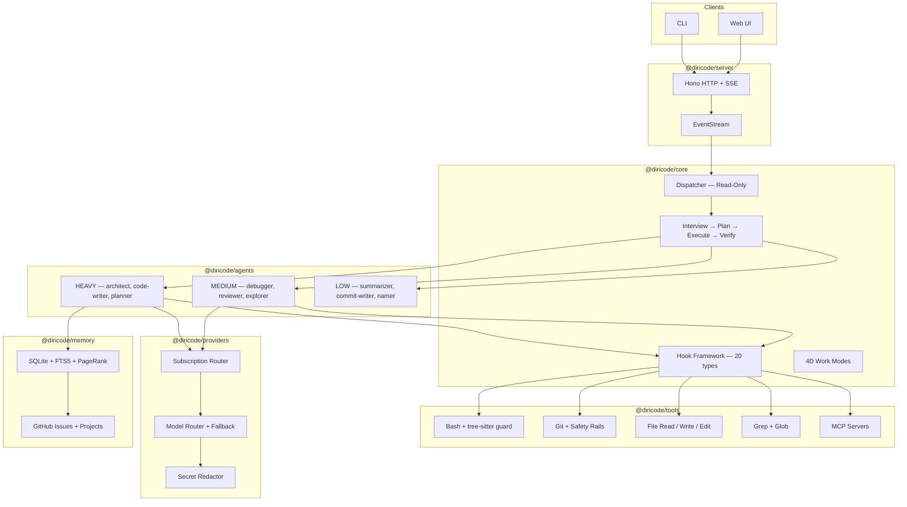
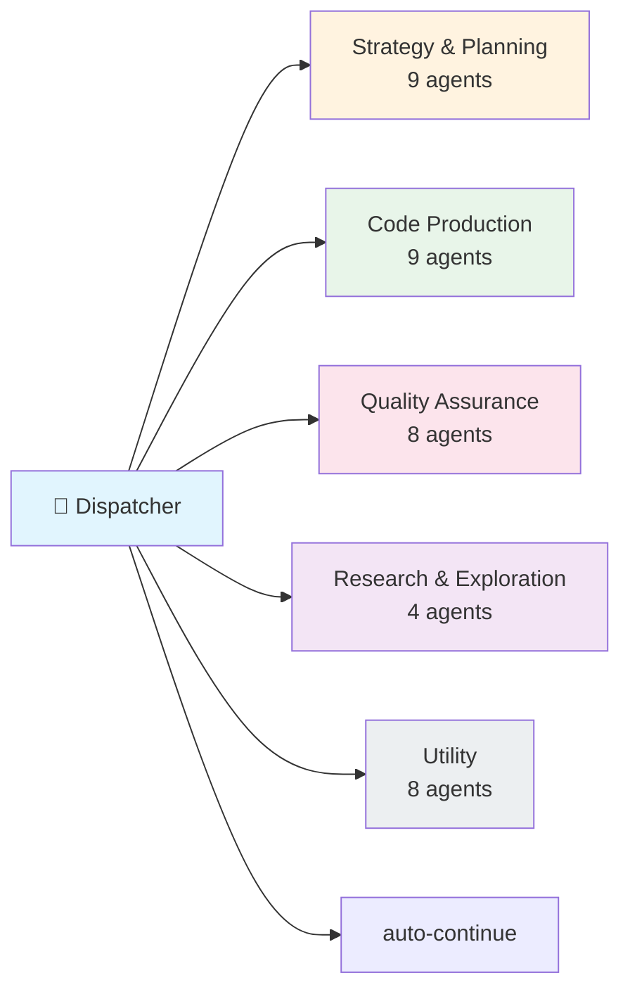
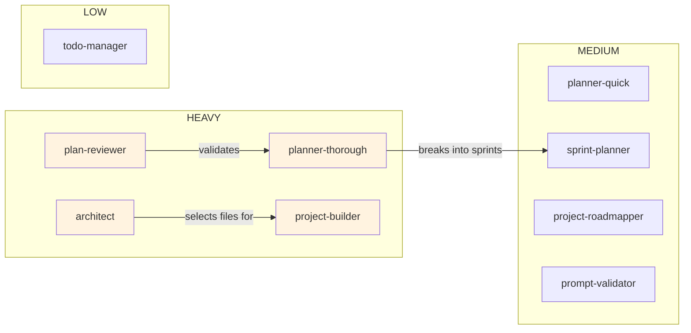
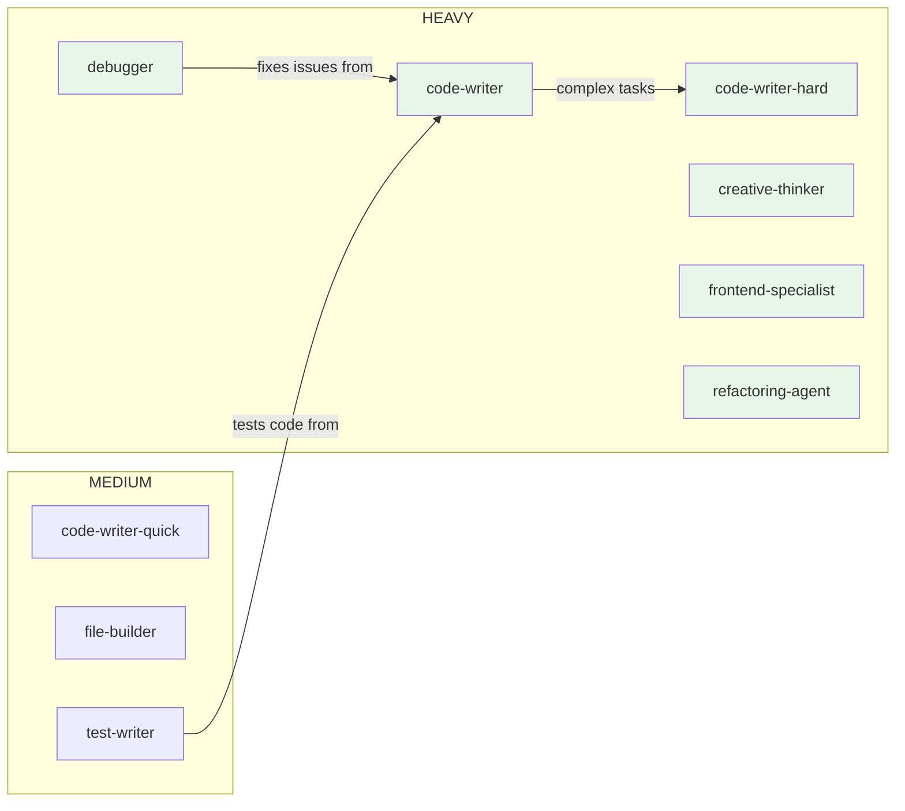
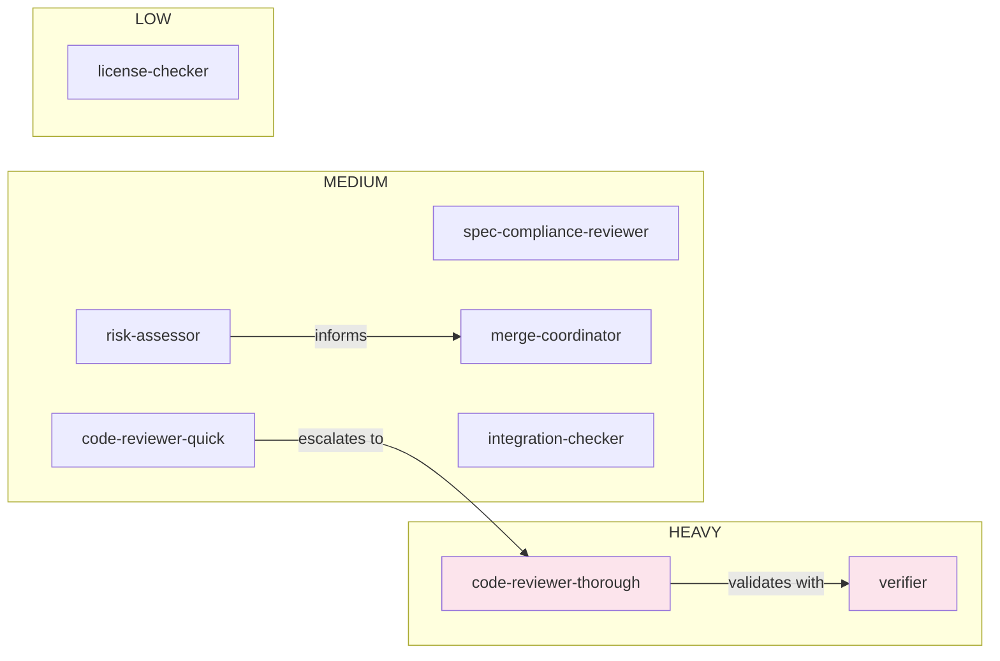
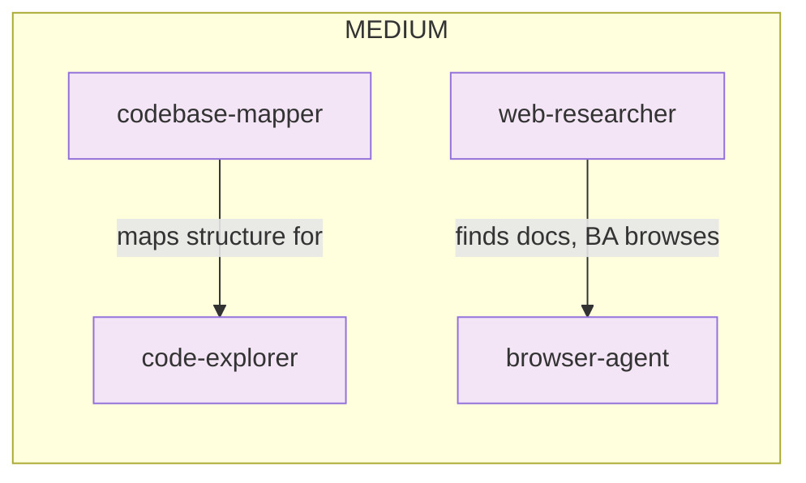
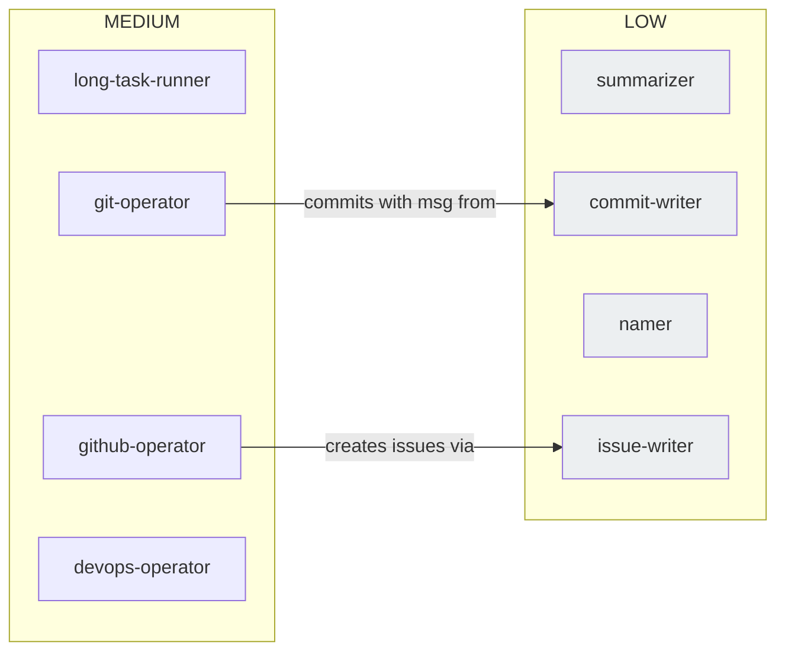

# DiriCode

[](https://opensource.org/licenses/MIT)
[](https://github.com/radoxtech/diricode/actions)
[](https://nodejs.org/)

An autonomous AI coding framework that manages your project through GitHub Issues and Projects. DiriCode runs sprints, delegates to 40 specialized agents, works in parallel across git worktrees, and reports progress back to you — while you review from your phone.

> **Status: Pre-MVP (v0.0.0)**. Active early development. Core subsystems are functional, but the full pipeline is not yet wired end-to-end.

---

## What Makes DiriCode Different

Most AI coding tools are glorified chatbots — you type, they respond, state disappears. DiriCode is designed to work more like an autonomous development team:

- **GitHub Projects is the brain.** Plans, sprints, tasks, and progress live in GitHub Issues and Projects — not in hidden local files. You can check what agents are doing from your phone, reprioritize tasks on the go, and multiple agent sessions can work on the same project simultaneously without stepping on each other.

- **Sprint-based execution.** DiriCode doesn't just answer one question at a time. It interviews you to understand the full scope, builds a plan broken into sprints and epics, then executes tasks in parallel across isolated git worktrees. When it hits a blocker, it finishes everything else it can, does a project review, and replans. It only asks you questions when it genuinely gets stuck or when a decision requires your taste.

- **Continuous progress reports.** While agents work, you receive real-time reports. If you have time, you can read them and guide the work. If you don't, agents keep going autonomously. You're never blocked, and neither are they.

- **40 specialized agents, not one do-everything bot.** There's an architect, a debugger, a test writer, a code reviewer, a frontend specialist, a web researcher — each one assigned to the right AI model for its job. A read-only dispatcher orchestrates them without ever writing code itself.

- **Safety you can't turn off.** Every bash command is parsed into an AST by tree-sitter before execution. Git operations go through mandatory safety rails. Secrets are automatically redacted before reaching any AI model. These protections are always on — even at maximum autonomy.

## The Vision

DiriCode is being built toward a future where you describe what you want to build, and an autonomous orchestrator turns that into a working product — running sprints, managing its own backlog, and asking for your input only when it matters. Here's how the pieces fit together:

### How It Works (End-to-End Flow)

```
You describe what you want
        ↓
    Interview Phase — DiriCode asks clarifying questions
        ↓
    Planning Phase — breaks work into sprints, epics, and tasks (stored in GitHub Issues)
        ↓
    Execution Phase — agents work in parallel across git worktrees
        ↓
    ┌── Agent hits a blocker? → parks it, continues other tasks
    ├── Agent unsure about a design choice? → buffers the question
    ├── Enough questions buffered? → asks you all at once
    └── All tasks done in this sprint? → runs verification
        ↓
    Verify Phase — automated review, tests, lint checks
        ↓
    Sprint Review — evaluates progress, replans, starts next sprint
        ↓
    You review from GitHub Projects, approve PRs, give feedback
```

### Two-Dimensional Model Selection

Instead of hardcoding "use GPT for everything," DiriCode classifies AI models along two dimensions:

**Tier** — how powerful (and expensive) the model is:

| Tier   | Used For                                         | Examples                               |
| ------ | ------------------------------------------------ | -------------------------------------- |
| HEAVY  | Architecture, complex reasoning, thorough review | Opus 4.6, GPT-5.4, Gemini 3.1 Pro      |
| MEDIUM | Standard coding, quick review, debugging         | Sonnet 4.6, Kimi 2.5, Qwen3 Coder Next |
| LOW    | Commit messages, naming, summaries               | Haiku 4.5, DeepSeek V3.2               |

**Family** — what the model is good at:

| Family       | Strength                                         |
| ------------ | ------------------------------------------------ |
| Reasoning    | Complex logic, math, architecture decisions      |
| Creative     | Brainstorming, unconventional solutions, writing |
| UI/UX        | Frontend code, styling, design systems           |
| Speed        | Low latency responses, high throughput           |
| Web Research | Searching, browsing, information gathering       |
| Bulk         | High volume work at minimal cost                 |
| Agentic      | Tool use, multi-step autonomous execution        |

Each agent requests `{ tier: "heavy", family: "reasoning" }` and the router finds the best available model across all your subscriptions. A single model can belong to multiple families — Opus 4.6 is reasoning + creative + agentic.

See [ADR-004](docs/adr/adr-004-agent-roster-3-tiers.md) and [ADR-042](docs/adr/adr-042-multi-subscription-management.md).

### Multi-Subscription Management

You probably have more than one AI subscription — maybe an Anthropic API key, an Azure OpenAI account through work, a GitHub Copilot plan, and a free-tier Google AI key. DiriCode uses all of them simultaneously:

- **Automatic rotation.** When one subscription hits its rate limit, requests immediately route to the next available subscription that offers an equivalent model.
- **Auto-recovery.** When a rate limit resets, that subscription automatically rejoins the rotation pool.
- **Cost awareness.** The router prefers cheaper subscriptions when model quality is equivalent.
- **Budget caps.** Set monthly spending limits per subscription. The system respects them.

**Planned (v2):** Quality scoring — track which models produce the best results for which tasks, using Elo-style ratings built from automated signals (did the code compile? did tests pass?) and optional human feedback.

**Planned (v3):** A/B testing — run structured experiments comparing models on identical tasks to make data-driven decisions about which models to use where.

See [ADR-042](docs/adr/adr-042-multi-subscription-management.md).

### Observability — See Everything

DiriCode treats transparency as a core feature, not an afterthought:

- **Agent tree.** A live hierarchical view showing which agents are running, who spawned whom, what each one is doing right now, and how many tokens they've used.
- **Metrics bar.** Real-time token count, cost, elapsed time, and which model is active — always visible.
- **Live activity indicator.** See exactly what the current agent is doing: reading a file, calling a model, running a test.
- **Continuous reports.** Agents push progress updates as they work. If you're watching, you can steer. If you're not, they keep going.

**Planned (v2):** Click any agent in the tree to see its full conversation, tool calls, and token breakdown. Timeline/waterfall view showing parallel execution branches.

**Planned (v3):** Cost analytics dashboard, performance profiling, model comparison views.

See [ADR-031](docs/adr/adr-031-observability-eventstream-agent-tree.md).

### GitHub Projects as the Backend

This is DiriCode's most unconventional design choice. Instead of storing state in local SQLite databases or hidden config files, DiriCode uses GitHub Issues and Projects as its primary state backend:

- **Plans become Issues.** Each sprint task is a GitHub Issue with acceptance criteria, file lists, and implementation notes.
- **Progress is visible.** Move to GitHub Projects on your phone to see what's done, what's in progress, and what's blocked.
- **Multiple sessions, no conflicts.** Two agent sessions can work on different sprints of the same project simultaneously. No merge conflicts on state files because there are no state files — just GitHub Issues.
- **SQLite as cache.** A local SQLite database with FTS5 full-text search serves as a fast local cache and timeline of events. It syncs with GitHub, not the other way around.

See [ADR-022](docs/adr/adr-022-github-issues-sqlite-timeline.md).

## Architecture



Architecture decisions are documented in [42 ADRs](docs/adr/).

## Key Design Decisions

### 4-Dimension Work Modes

Instead of a binary "safe vs yolo" toggle, DiriCode uses four independent dimensions you can tune:

| Dimension      | Range | Low end          | High end           |
| -------------- | ----- | ---------------- | ------------------ |
| **Quality**    | 1-5   | Cheap/fast (POC) | Production-grade   |
| **Autonomy**   | 1-5   | Ask everything   | Full auto          |
| **Verbosity**  | 1-4   | Silent           | Narrated           |
| **Creativity** | 1-5   | Reactive/minimal | Proactive/creative |

Quality controls which model tier agents use. Autonomy controls how much human approval is needed. These are independent — you can run full-auto at POC quality for rapid prototyping, or ask-everything at production quality for critical systems.

See [ADR-012](docs/adr/adr-012-4-dimension-work-mode-system.md).

### Agent Roster — 40 Agents, 6 Categories

The dispatcher selects agents dynamically via `search_agents()` — it searches by capability tags, not a hardcoded list.



<details>
<summary><b>Strategy & Planning</b> — 9 agents</summary>



</details>

<details>
<summary><b>Code Production</b> — 9 agents</summary>



</details>

<details>
<summary><b>Quality Assurance</b> — 8 agents</summary>



</details>

<details>
<summary><b>Research & Exploration</b> — 4 agents</summary>



</details>

<details>
<summary><b>Utility</b> — 8 agents</summary>



</details>

See [ADR-004](docs/adr/adr-004-agent-roster-3-tiers.md) and [ADR-040](docs/adr/adr-040-tool-based-agent-discovery.md).

### Safety Architecture

Three layers of protection that are always on, even at Autonomy level 5:

- **Tree-sitter Bash parsing.** Commands are parsed into ASTs before execution. Detects `rm -rf /`, pipes to `sh`, fork bombs — not with regex, but with a real parser. See [ADR-029](docs/adr/adr-029-treesitter-bash-parsing.md).
- **Git safety rails.** Blocks `git add .` without review, requires confirmation for `--force` and `reset --hard`. Cannot be disabled. See [ADR-027](docs/adr/adr-027-git-safety-rails.md).
- **Secret redaction.** Scans for API keys, tokens, and credentials before any data reaches an AI model. See [ADR-028](docs/adr/adr-028-secret-redaction.md).

Tool actions are categorized as Safe, Risky, or Destructive — each with different approval requirements. See [ADR-014](docs/adr/adr-014-smart-hybrid-approval.md).

### Hook Framework

20 hook types across lifecycle, safety, pipeline, and context categories. Two execution models:

- **Interceptors** — Sequential state modification (e.g., `session-start`, `post-commit`)
- **Wrappers** — Control flow, retries, safety (e.g., `pre-commit`, `pre-tool-use`)

Hooks can be TypeScript or external scripts (Python, bash). See [ADR-024](docs/adr/adr-024-hook-framework-20-types.md).

### Context Management

A 3-layer system that keeps agents under 50% of their context window:

1. **Structural Index** — SQLite + Tree-sitter + PageRank ranks files by importance
2. **Condenser Pipeline** — 3-stage compression: dedup, masking, summarization
3. **Context Composer** — Adaptive token budgets per category (files, history, tools, system)

The architect agent picks specific files per subtask rather than dumping the whole codebase. See [ADR-016](docs/adr/adr-016-3-layer-context-management.md).

### Skills and MCP

Custom agents and skills via `SKILL.md` files (compatible with [agentskills.io](https://agentskills.io)). Integration with [Model Context Protocol](https://modelcontextprotocol.io/) servers for web search (zero API keys required) and Playwright browser automation.

See [ADR-008](docs/adr/adr-008-skill-system-agentskills-io.md) and [ADR-041](docs/adr/adr-041-mcp-web-research-servers.md).

### Configuration

JSONC config via [c12](https://github.com/unjs/c12) with a 4-layer hierarchy:

```
CLI flags / DC_* env vars  →  Project .dc/  →  Global ~/.config/dc/  →  Defaults
```

All config validated with Zod schemas. See [ADR-009](docs/adr/adr-009-jsonc-config-c12-loader.md).

## Project Structure

```text
apps/
  cli/              CLI entrypoint (dc / diricode commands)
packages/
  core/             Agent interfaces, config schema (Zod), tool types
  agents/           Dispatcher agent and registry
  tools/            File ops, grep, glob, bash execution with safety filter
  providers/        Multi-LLM provider interface and registry
  server/           Hono HTTP server with REST API + SSE transport
  memory/           SQLite database with FTS5 search
  web/              Web UI (planned — Vite + React + shadcn/ui)
docs/
  adr/              42 Architecture Decision Records
  mvp/              MVP epic specifications
```

## Status

| Component           | Status     | Details                                              |
| ------------------- | ---------- | ---------------------------------------------------- |
| Dispatcher Agent    | ✅ Done    | Read-only orchestrator with dynamic agent discovery  |
| Tool Suite          | ✅ Done    | Bash (tree-sitter), file read/write/edit, grep, glob |
| Provider Layer      | ✅ Done    | Unified LLM interface with failover chain            |
| CLI                 | ✅ Done    | REPL and one-shot modes with flag parsing            |
| Memory              | ✅ Done    | SQLite + FTS5 persistence layer                      |
| HTTP + SSE          | ✅ Done    | Hono server with SSE event transport                 |
| CI                  | ✅ Done    | GitHub Actions with Turborepo caching                |
| Pipeline            | 🏗️ WIP     | Interview → Plan → Execute → Verify                  |
| Hook Framework      | 🏗️ WIP     | 20 hook types (interceptors + wrappers)              |
| Agent Roster        | 🏗️ WIP     | 40 agents planned, dispatcher operational            |
| Context Manager     | 🏗️ WIP     | 3-layer system with PageRank indexing                |
| Secret Redaction    | ⏳ Planned | Pattern-based masking before LLM dispatch            |
| Config System       | ⏳ Planned | JSONC + c12, 4-layer hierarchy                       |
| Skill System        | ⏳ Planned | SKILL.md definitions, agentskills.io compatibility   |
| Subscription Router | ⏳ Planned | Multi-subscription rotation + health tracking        |
| Web UI              | ⏳ Planned | Agent tree, event stream, metrics dashboard          |
| Quality Scoring     | 📋 v2      | Elo-based model quality tracking                     |
| A/B Testing         | 📋 v3      | Structured model comparison experiments              |

## Roadmap

| Version   | Theme                | Key Deliverable                                                        |
| --------- | -------------------- | ---------------------------------------------------------------------- |
| **MVP**   | Core engine + Web UI | Working agent system with pipeline, web interface, real task execution |
| **MVP-2** | Multi-subscription   | Subscription rotation, health tracking, auto-recovery                  |
| **v2**    | Ecosystem + Quality  | Quality scoring, embeddings, skill marketplace, TUI                    |
| **v3**    | Safety + Automation  | A/B testing, sandbox, auto-advance, GitLab backend                     |
| **v4**    | Enterprise           | Jira backend, multi-user support                                       |

## Getting Started

### Prerequisites

- Node.js >= 20
- pnpm >= 9

### Installation

```bash
git clone https://github.com/radoxtech/diricode.git
cd diricode
pnpm install
pnpm build
```

### Running the CLI

```bash
# Interactive REPL
pnpm --filter @diricode/cli dev

# One-shot prompt
pnpm --filter @diricode/cli dev run "your prompt here"

# See all options
pnpm --filter @diricode/cli dev -- --help
```

## Development

Built with [Turborepo](https://turbo.build/) and [Vitest](https://vitest.dev/).

```bash
pnpm build          # Build all packages
pnpm test           # Run tests
pnpm lint           # Lint all packages
pnpm format         # Format with Prettier
pnpm typecheck      # TypeScript type checking
```

## Contributing

DiriCode is in early development. Contributions are welcome.

A `CONTRIBUTING.md` is coming soon. Start by reading the [Architecture Decision Records](docs/adr/) to understand the design philosophy.

## License

[MIT](LICENSE) © Rado x Tech
