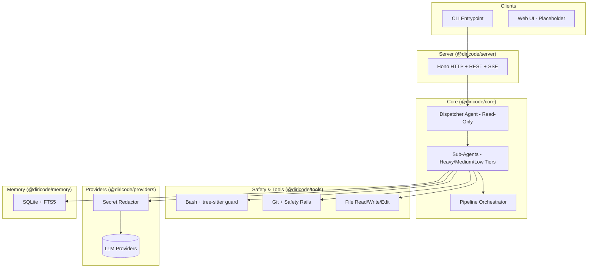

# DiriCode

[](https://opensource.org/licenses/MIT)
[](https://github.com/radoxtech/diricode/actions)
[](https://nodejs.org/)

DiriCode is an open-source, multi-agent AI coding framework designed for high-autonomy software development. Built with a dispatcher-first architecture, it orchestrates specialized sub-agents through a structured pipeline to move from initial interview to verified code.

> **Status: Pre-MVP (v0.0.0)**. This project is in active early development. Core components are being built, but the full autonomous pipeline is not yet operational. Not suitable for production use.

---

## Core Principles

- **Dispatcher-First**: A read-only orchestrator manages the high-level state and delegates all write operations to specialized sub-agents.
- **Pipeline-Based Execution**: Tasks move through defined stages: Interview → Plan → Execute → Verify.
- **Safety by Design**: Bash commands are parsed via tree-sitter before execution, git safety rails are mandatory, and secrets are redacted before reaching any LLM.
- **Provider Agnostic**: Multi-LLM support via a unified provider interface, avoiding vendor lock-in.
- **Extensible Architecture**: Deeply customizable through a hook framework, skill definitions (SKILL.md), and MCP server integration.

## Architecture

DiriCode uses a modular monorepo structure where the dispatcher coordinates specialized agents and tools.



Detailed architecture decisions are documented in over 40 [Architecture Decision Records (ADRs)](docs/adr/).

## Project Structure

```text
apps/
  cli/              CLI entrypoint (dc / diricode commands)
packages/
  core/             Agent interfaces, config schema (Zod), and tool types
  agents/           Dispatcher agent and sub-agent registry
  tools/            Secure file and shell execution tools
  providers/        Multi-LLM provider interface and secret redaction
  server/           Hono HTTP server with SSE transport
  memory/           SQLite persistence with FTS5 search
docs/
  adr/              41 Architecture Decision Records
  mvp/              MVP epic specifications
```

## Work Modes

DiriCode operates across four dimensions to balance speed and quality:

1. **Quality**: Toggle between quick iterations and thorough analysis/review.
2. **Autonomy**: Control the level of human-in-the-loop requirements.
3. **Verbose**: Adjust the level of detail in agent thought processes and output.
4. **Creativity**: Fine-tune the balance between strict adherence and exploratory solutions.

## Status & Roadmap

| Feature          | Status     | Description                                               |
| ---------------- | ---------- | --------------------------------------------------------- |
| Dispatcher Agent | ✅ Done    | Core orchestrator and registry                            |
| Tooling          | ✅ Done    | Bash safety (tree-sitter), file ops, grep, glob           |
| Multi-Provider   | ✅ Done    | Unified LLM interface with registry                       |
| CLI              | ✅ Done    | Entrypoint with flag parsing, REPL and one-shot modes     |
| Memory           | ✅ Done    | SQLite + FTS5 persistence                                 |
| HTTP + SSE       | ✅ Done    | Hono server with REST API and SSE event transport         |
| CI               | ✅ Done    | GitHub Actions with Turborepo caching                     |
| Pipeline         | 🏗️ WIP     | Wiring Interview → Plan → Execute → Verify                |
| Hook Framework   | 🏗️ WIP     | Lifecycle, safety, and pipeline hooks (20 types planned)  |
| Agent Roster     | 🏗️ WIP     | Expanding beyond the dispatcher to 15+ specialized agents |
| Secret Redaction | ⏳ Planned | Auto-mask secrets before sending to LLMs                  |
| Web UI           | ⏳ Planned | Interactive dashboard and real-time agent tree            |

## Getting Started

### Prerequisites

- Node.js >= 20.0.0
- pnpm >= 9.0.0

### Installation

1. Clone the repository:

   ```bash
   git clone https://github.com/radoxtech/diricode.git
   cd diricode
   ```

2. Install dependencies:

   ```bash
   pnpm install
   ```

3. Build the project:
   ```bash
   pnpm build
   ```

### Running the CLI

```bash
# Interactive REPL (default)
pnpm --filter @diricode/cli dev

# One-shot prompt
pnpm --filter @diricode/cli dev run "your prompt here"

# See all options
pnpm --filter @diricode/cli dev -- --help
```

## Development

This project uses [Turborepo](https://turbo.build/) for build orchestration and [Vitest](https://vitest.dev/) for testing.

- **Build**: `pnpm build`
- **Test**: `pnpm test`
- **Lint**: `pnpm lint`
- **Format**: `pnpm format`

## Contributing

DiriCode is in its early stages and we welcome contributors who are interested in building a robust, safe, and modular AI coding assistant.

A formal `CONTRIBUTING.md` is coming soon. In the meantime, feel free to explore the [ADRs](docs/adr/) to understand the architectural vision.

## License

[MIT](LICENSE) © Rado x Tech
