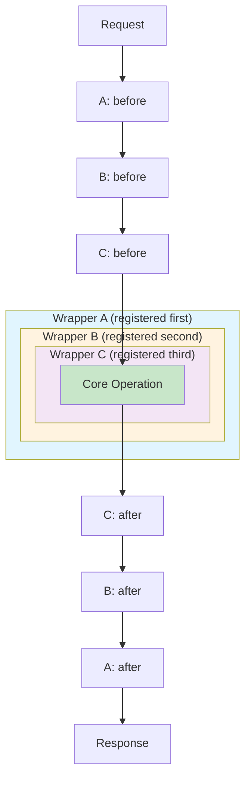

# ADR-034 — Middleware Execution Order Contract

| Field       | Value                                         |
|-------------|-----------------------------------------------|
| Status      | Draft                                         |
| Date        | 2026-03-18                                    |
| Scope       | MVP                                           |
| References  | ADR-033 (Interceptor/Wrapper Split)           |

### Context

The hook framework (ADR-024) supports three execution phases: `before` interceptors, `wrap` wrappers, and `after` interceptors. Without a clearly defined execution order contract, middleware registration becomes unpredictable and debugging becomes difficult. This ADR establishes formal rules for how hooks execute relative to their registration order.

### Decision

**Formal execution order contract** for all middleware types:

| Phase | Execution Order | Pattern | Mnemonic |
|-------|----------------|---------|----------|
| `before` | Registration order | FIFO | "First registered, first executed" |
| `wrap` | Nested (onion model) | Outer-to-inner | "Outer wraps inner" |
| `after` | Reverse registration order | LIFO | "Last registered, first executed" |

#### Onion Model Visualization

The `wrap` phase uses a nested onion model where the first registered wrapper becomes the outermost layer. This mirrors how middleware stacks work in Express.js, Koa, and other frameworks.



#### Execution Sequence Example

```typescript
// Registration order (FIFO)
manager.register('before', loggerBefore);      // #1
manager.register('before', authBefore);        // #2
manager.register('before', rateLimitBefore);   // #3

manager.register('wrap', loggingWrapper);      // #1 (outermost)
manager.register('wrap', metricsWrapper);      // #2 (middle)
manager.register('wrap', cachingWrapper);      // #3 (innermost)

manager.register('after', cleanupAfter);       // #1
manager.register('after', auditAfter);         // #2
manager.register('after', notifyAfter);        // #3

// Execution order during operation:
// BEFORE phase (FIFO):
//   1. loggerBefore
//   2. authBefore
//   3. rateLimitBefore
//
// WRAP phase (onion model, outermost first):
//   1. loggingWrapper opens
//     2. metricsWrapper opens
//       3. cachingWrapper opens
//         [core operation executes]
//       3. cachingWrapper closes
//     2. metricsWrapper closes
//   1. loggingWrapper closes
//
// AFTER phase (LIFO):
//   3. notifyAfter
//   2. auditAfter
//   1. cleanupAfter
```

### Consequences

**Positive:**
- Predictable execution order makes debugging straightforward
- Onion model for wrappers enables clean cross-cutting concerns (logging wraps metrics wraps caching)
- LIFO for `after` hooks ensures proper cleanup in reverse order of setup
- Aligns with industry-standard middleware patterns

**Negative / Trade-offs:**
- Developers must understand three different ordering rules
- Wrong mental model leads to subtle bugs (e.g., expecting FIFO for `after` hooks)

**Migration notes:**
- Existing hooks should be audited against this contract
- No breaking changes if current implementation already follows these rules

### Details

#### Registration vs Execution Order Summary

| Registered | `before` Exec | `wrap` Exec (outer→inner) | `after` Exec |
|------------|---------------|---------------------------|--------------|
| 1st | 1st | Outermost | Last |
| 2nd | 2nd | Middle | Middle |
| 3rd | 3rd | Innermost | First |

#### TypeScript Interface

```typescript
interface ExecutionOrderContract {
  /**
   * Interceptors run in registration order (FIFO).
   * Useful for: validation, authentication, logging entry points
   */
  before: 'FIFO';
  
  /**
   * Wrappers run in nested onion model.
   * First registered = outermost layer.
   * Useful for: logging, metrics, transactions, caching
   */
  wrap: 'NESTED_OUTER_FIRST';
  
  /**
   * Interceptors run in reverse registration order (LIFO).
   * Useful for: cleanup, audit logs, notifications
   */
  after: 'LIFO';
}
```

#### Common Patterns

**Request Tracing (outermost wrapper):**
- Register first as wrap → becomes outermost → captures full lifecycle

**Cleanup (last `after` hook):**
- Register first in `after` → executes last → ensures cleanup happens after all other `after` hooks

**Authentication (early `before`):**
- Register early in `before` → fails fast before other processing
