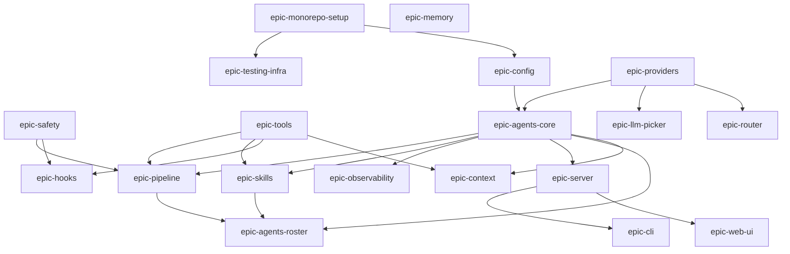

# DiriCode: MVP Dependency Graph

> **Last updated**: 2026-03-31  
> **Purpose**: Tracks dependencies between epics and issue groups to guide delivery sequencing.

## Epic Dependency Graph

## Issue Group Dependencies

| Issue Group | Depends On | Blocks | Phase |
| :--- | :--- | :--- | :--- |
| DC-MONO-* | None | Everything | POC |
| DC-TEST-* | DC-MONO | Quality Gates | POC |
| DC-CONF-* | DC-MONO | CORE, PROV | POC |
| DC-PROV-001 | None | PROV-002..007, CORE | POC |
| DC-PROV-002/007 | DC-PROV-001 | CORE | POC |
| DC-PROV-003 | DC-PROV-001 | PROV-004/006 | POC |
| DC-PROV-004 | DC-PROV-003 | PROV-005/006 | POC |
| DC-PROV-005 | DC-PROV-002/004/007 | High-level orchestration | POC |
| DC-PROV-006 | DC-PROV-003/004 | High-level orchestration | POC |
| DC-CORE-* | DC-CONF, DC-PROV | PIPE, SKILL, ROST, SRV | POC |
| DC-SAFE-001..005 | DC-CORE-001, TOOL Primitives | Mutating Tools, PIPE | POC |
| DC-TOOL-001..006 | DC-SAFE-001, DC-CORE-001 | PIPE, SKILL | POC |
| DC-MEM (SQLite) | None | Persistence | POC/MVP-1 |
| DC-OBS-* | DC-CORE | Visibility | MVP-1 |
| DC-PIPE-* | DC-CORE, DC-TOOL, DC-SAFE | E2E Execution | MVP-1 |
| DC-TOOL-007..008 | DC-TOOL-004, DC-SAFE-003 | MVP-1 Features | MVP-1 |
| DC-SKILL-001..007 | DC-CORE, DC-TOOL-001..012 | ROST | MVP-1/MVP-2 |
| DC-SRV-* | DC-CORE | CLI, WEB | MVP-1 |
| DC-CLI-* | DC-SRV | End-user Access | MVP-1 |
| DC-WEB-* | DC-SRV | End-user Access | MVP-1 |
| DC-HOOK-* | DC-SAFE, DC-TOOL | Cross-cutting logic | MVP-1 |
| DC-CTX-* | DC-TOOL, DC-CORE | Context Management | MVP-1 |
| DC-AGENT-* | DC-CORE, DC-SKILL, DC-PIPE | Production Roster | MVP-1 |
| DC-SAFE-006 | DC-SAFE-005, SQLite | Advanced Permissions | MVP-2 |
| DC-TOOL-009..018 | DC-TOOL-001..008, SQLite | Advanced Tools | MVP-2 |
| DC-ROUTER-020..022| DC-PROV-001..007 | Advanced Routing | MVP-2 |
| DC-LLM-* | DC-PROV-001..007 | LLM Picking | MVP-2 |
| DC-MEM-R001/002 | Research Required | Advanced Memory | v2+ |

## Delivery Phases

### POC
Foundational elements required to prove the core agent-loop and basic tool usage.
- **DC-MONO**: Repository structure and package management.
- **DC-TEST**: Initial testing frameworks.
- **DC-CONF**: Basic configuration management.
- **DC-PROV-001..007**: Initial provider integration.
- **DC-CORE**: Basic agent runtime and event stream.
- **DC-SAFE-001..005**: Initial safety boundaries.
- **DC-TOOL-001..006**: Fundamental tool primitives.

### MVP-1
Functional system capable of end-to-end task execution with observability and CLI/Web interfaces.
- **DC-PIPE**: Pipeline execution engine.
- **DC-OBS**: Basic telemetry and tracing.
- **DC-SRV**: API server for UI/CLI communication.
- **DC-CLI / DC-WEB**: User-facing interfaces.
- **DC-AGENT**: Initial roster of specialized agents.
- **DC-SKILL**: Basic skill system for agents.
- **DC-MEM**: SQLite-backed persistence for sessions.

### MVP-2
Enhanced capabilities, advanced safety, and refined routing.
- **DC-LLM**: Intelligent LLM selection.
- **DC-ROUTER**: Advanced provider routing logic.
- **DC-SAFE-006**: Refined permission systems.
- **DC-TOOL-009..018**: Advanced tools (e.g., browser automation, complex file ops).
- **DC-SKILL-004..006**: Advanced agent skills.

### v2+
Long-term architectural enhancements.
- **DC-MEM-R001**: ReasoningBank for long-term pattern storage.
- **DC-MEM-R002**: MemoryDir for structured experience retrieval.

## Critical Path (MVP-1 Exit)

1. **Monorepo & Config Setup** (DC-MONO, DC-CONF)
2. **Provider Foundation** (DC-PROV-001)
3. **Core Runtime** (DC-CORE)
4. **Safety Primitives** (DC-SAFE-001..005)
5. **Tool Primitives** (DC-TOOL-001..006)
6. **Pipeline Engine** (DC-PIPE)
7. **API Server** (DC-SRV)
8. **UI/CLI Integration** (DC-CLI, DC-WEB)
