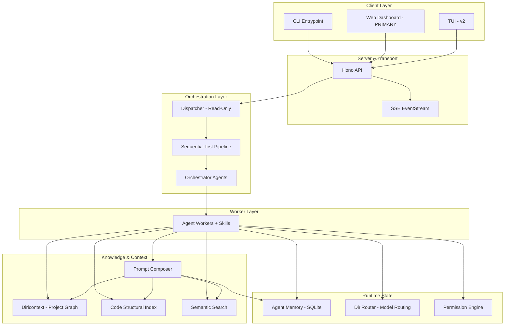

# DiriCode — Project Overview

DiriCode is a local-first agentic coding framework designed for high-autonomy software development. It operates as a modular system where specialized agents cooperate through a structured pipeline to plan, execute, and verify complex engineering tasks. Built with a "vibe coding" philosophy, it prioritizes developer experience, observability, and resumable execution.

## 9-Module Architecture

The framework is organized into nine distinct modules, each owning a specific concern of the agentic lifecycle. This modularity ensures that concerns like project knowledge, codebase indexing, and model routing remain decoupled and independently maintainable.

| # | Module | Package | Status | Role |
|---|--------|---------|--------|------|
| 0 | **Diricontext** | `packages/project-planner/` | In Progress | Graph-based directed context — project knowledge across 3 namespaces |
| 1 | **Code Structural Index** | `packages/code-index/` | Planned | Tree-sitter parsing, PageRank file scoring, and FTS5 symbol search |
| 2 | **Prompt Composer** | `packages/prompt-composer/` | Planned | 3-layer context management and token budget orchestration |
| 3 | **Semantic Search** | `packages/semantic-search/` | Planned | Embedding provider abstraction and hybrid FTS5+vector search |
| 4 | **Agent Memory** | `packages/memory/` | Existing | SQLite-backed session state, ReasoningBank, and turn persistence |
| 5 | **DiriRouter** | `packages/dirirouter/` | Existing | Context-aware model routing, provider registry, and cost tracking |
| 6a | **Agent Workers** | `packages/agents/` | Existing | Specialized agents that perform work and execute skills |
| 6b | **Orchestrators** | `packages/orchestrators/` | Planned | Coordination, delegation, and monitoring logic |
| 7 | **Permission Engine** | `packages/core/` | Existing | Granular permission levels, audit logging, and safety handlers |

## Architecture Diagram

## Module Descriptions

### Module 0: Diricontext (`packages/project-planner/`)
A graph-based directed context system that stores project knowledge across three namespaces: **docs** (what IS), **plan** (what WILL BE), and **reference** (external context). It functions as both an MCP server and a library, providing agents with structured insights into features, tasks, and architectural decisions.

### Module 1: Code Structural Index (`packages/code-index/`)
Uses tree-sitter to parse the codebase into a persistent SQLite index. It builds import graphs, computes PageRank file scores to identify "important" files, and exposes FTS5 full-text search over symbols. This ensures agents can navigate large repositories without exhausting context windows.

### Module 2: Prompt Composer (`packages/prompt-composer/`)
Manages the runtime token budget through a 3-layer architecture. It consumes the structural index, runs a condenser pipeline (deduplication, masking, and summarization), and assembles the final prompt to ensure high-density context within model limits.

### Module 3: Semantic Search (`packages/semantic-search/`)
Provides a unified abstraction for embedding providers and vector storage via `sqlite-vec`. It enables hybrid search patterns by combining FTS5 keyword matching with vector similarity, allowing agents to find relevant code and documentation through semantic intent.

### Module 4: Agent Memory (`packages/memory/`)
The source of truth for all runtime state. It persists session history, message turns, and agent observations in SQLite. It includes the **ReasoningBank**, which stores problem-approach-outcome triplets to allow agents to learn from past successes and failures across sessions.

### Module 5: DiriRouter (`packages/dirirouter/`)
A unified model routing package that handles provider registration, cost tracking, and fallback chains. It uses context-aware tiers (LOW, MEDIUM, HEAVY) to select the optimal model for a given task, balancing performance, cost, and context window requirements.

### Module 6a: Agent Workers (`packages/agents/`)
Specialized agents designed to perform specific technical tasks. Workers possess specialized instructions and can be granted **skills** (defined in `SKILL.md` files) to extend their capabilities. They are the primary actors that interact with tools and modify the filesystem.

### Module 6b: Orchestrators (`packages/orchestrators/`)
Agents dedicated to coordination and management rather than direct technical work. This includes the dispatcher, sequential executors, and background task managers. Orchestrators delegate to workers and aggregate their results, ensuring the dependency always flows from orchestrator to worker.

### Module 7: Permission Engine (`packages/core/`)
A cross-cutting safety layer that enforces granular permission levels. It provides audit logging for all sensitive operations and manages user approvals for tool execution. It is integrated into the core contracts to ensure safety is never an afterthought.

## Agent Roster

The roster is divided between **Workers** who do work and **Orchestrators** who coordinate.

### Workers
- **code-writer**: Implements features and fixes bugs.
- **code-explorer**: Research and codebase navigation.
- **planner-quick** & **planner-thorough**: Strategy formulation at different depths.
- **architect**: High-level structural design and pattern selection.
- **project-builder**: Handles boilerplate and project initialization.
- **sprint-planner**: Organizes tasks into executable milestones.
- **sandbox**: Isolated execution and verification.

### Orchestrators
- **dispatcher**: The primary entry point. Read-only, routes requests, and delegates tasks.
- **sequential-executor**: Manages turn-based pipeline execution.
- **background-task-manager**: Handles long-running or async sub-tasks.

**Key Principle**: Dependency flows from Orchestrator to Worker. Orchestrators decide whom to assign; Workers decide how to execute using their assigned skills.

## Key Design Decisions

- **Dispatcher-first (ADR-002)**: A read-only orchestrator manages all sub-agent coordination to prevent circular dependencies and state corruption.
- **Pipeline-first, Sequential-first (ADR-013)**: Execution follows a structured **Interview → Plan → Execute → Verify** sequence with first-class checkpoint and resume support.
- **DiriRouter Unified Routing (ADR-055)**: A single system manages model selection, scoring, and fallback, superseding the previous "LLM Picker" design.
- **Diricontext Structured Knowledge**: Project state is managed as a persistent graph rather than flat text, improving agent reasoning over complex feature maps.
- **EventStream Observability (ADR-031)**: All runtime actions emit typed events, providing a transparent, replayable record of agent activity.
- **SQLite Runtime Truth (ADR-048)**: Local SQLite databases serve as the primary source of truth for agent state and memory, ensuring a fast, local-first experience.

## Roadmap

### MVP-1 — First Believable Runtime
- Sequential-first execution with explicit turn lifecycles.
- Checkpoint and resume as a core requirement.
- EventStream-based transparency for all agent actions.
- Initial DiriRouter integration with context-aware tiers.
- Basic memory-backed runtime state.

### MVP-2 — Core Intelligence
- Implementation of Prompt Composer for advanced context management.
- Deployment of Code Structural Index with tree-sitter and PageRank.
- Permission Engine Phase 1 with granular levels.
- DiriRouter cost tracking and refined model scoring.

### v2 — Ecosystem Expansion
- Semantic Search with embeddings and hybrid retrieval.
- ReasoningBank extensions for cross-session learning.
- Observability v2 with structured metrics and trace correlation.
- Advanced hook framework for auto-advance and approval workflows.
- Sandbox environment for safe code execution.

### v3 — Advanced Orchestration
- Observability v3 with distributed tracing and anomaly detection.
- Bounded parallel execution and swarm coordination patterns.
- DiriRouter Elo scoring and automated A/B testing of model performance.

## Existing Packages

Today, the repository contains several active packages with more planned to complete the 9-module architecture:

- **apps/cli/**: CLI entry point for the framework.
- **packages/core/**: Shared types, contracts, and the Permission Engine.
- **packages/agents/**: Agent Worker implementations.
- **packages/tools/**: MCP tool schemas and handlers.
- **packages/dirirouter/**: Unified model routing and providers.
- **packages/memory/**: SQLite-backed agent memory and state.
- **packages/server/**: Hono-based API server.
- **packages/web/**: Primary Web Dashboard (Vite + React).
- **packages/project-planner/**: Diricontext implementation.
- **packages/github-mcp/**, **packages/web-search/**: Integration MCPs.
- **packages/test-harness/**, **packages/test-utils/**: Internal testing utilities.

**Planned Packages**: `orchestrators/`, `prompt-composer/`, `semantic-search/`, `code-index/`.
