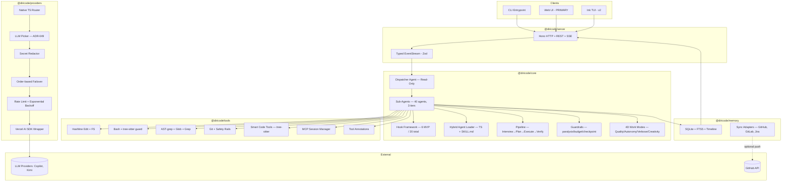
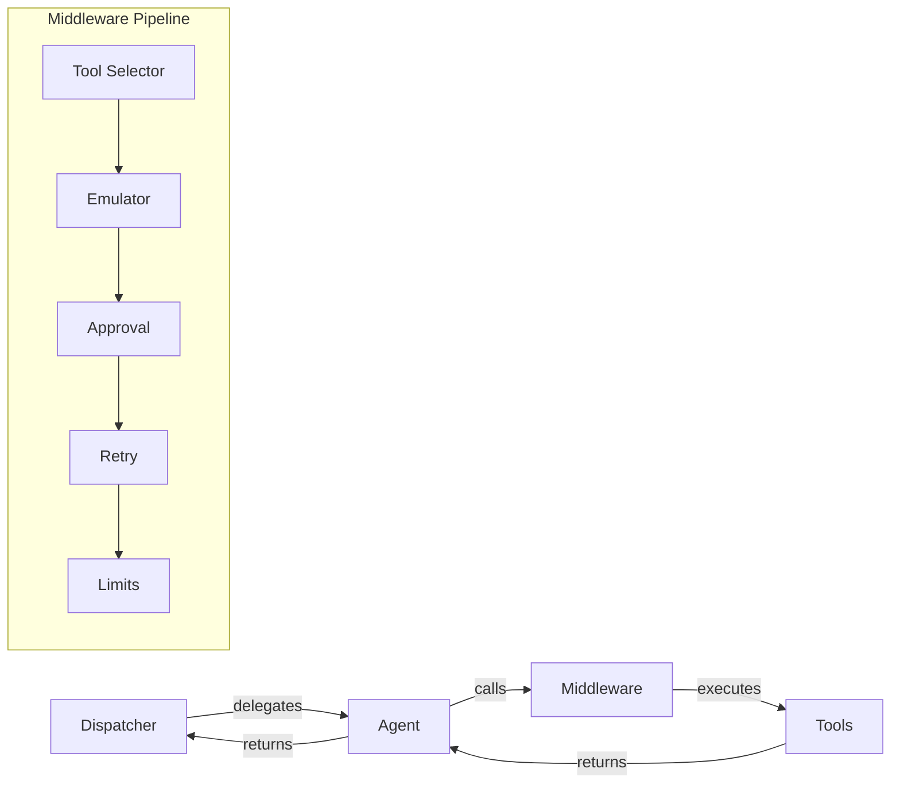

# DiriCode — Implementation Plan Overview

> Comprehensive implementation roadmap spanning MVP (4 iterations), v2, v3, v4.
> Generated from: 49 ADRs, MVP spec, and design decisions.
> Date: 2026-03-21

---

## Architecture (Mermaid)

---

## Middleware Pipeline

DiriCode uses a layered middleware approach inspired by LangChain's middleware patterns (implemented natively, no dependency):

**Key Patterns:**
- **Interceptor/Wrapper Split**: State modification vs control flow
- **Execution Order**: FIFO interceptors, nested wrappers, LIFO cleanup
- **Composition**: Wrappers compose naturally for safety, retry, limits

See [ADR-033: Interceptor/Wrapper Hook Split](adr/adr-033-interceptor-wrapper-hook-split.md), [ADR-034: Middleware Execution Order](adr/adr-034-middleware-execution-order.md), and [ADR-015: Tool Annotations](adr/adr-015-tool-annotations.md) for details.

## Version Roadmap

| Version | Theme | Iterations | Key Deliverable |
|---------|-------|-----------|-----------------|
| **MVP** | Core engine + Web UI | POC, MVP-1, MVP-2, MVP-3 | Working agent system with pipeline, web interface, and real task execution |
| **v2** | Ecosystem + Polish | v2.0, v2.1 | TUI, annotation approval, embeddings, skill marketplace, context monitoring |
| **v3** | Safety + Automation | v3.0, v3.1 | Sandbox, auto-advance, GitLab sync adapter, advanced hooks |
| **v4** | Enterprise + Scale | v4.0 | Jira backend, multi-user support |

---

## MVP Iteration Exit Criteria

| Iteration | Codename | Exit Criterion (Demo Scenario) |
|-----------|----------|-------------------------------|
| **POC** | "Wheel" | User types a prompt in CLI → dispatcher delegates to code-writer → file created on disk via Copilot. Technical spikes validated (Bun+tree-sitter, AI SDK+Copilot, SQLite FTS5, c12+JSONC). |
| **MVP-1** | "Scooter" | User types "add a login page" → planner creates a plan → code-writer implements → code-reviewer reviews → atomic git commit made. Memory persists across sessions. |
| **MVP-2** | "Bicycle" | Full pipeline runs: Interview→Plan→Execute→Verify. Hooks fire (pre-commit, plan-created). Guardrails catch analysis paralysis. Context management keeps agents under 50% window. Skills loaded from SKILL.md. |
| **MVP-3** | "Car" | User opens Web UI → sees real-time agent tree → watches pipeline execute → inspects cost metrics. All 15+ MVP agents operational. Observability dashboard functional. |

---

## Immutable Pillars

These decisions are foundational and NOT subject to change (from spec Section 10):

| Pillar | ADR | Summary |
|--------|-----|---------|
| HTTP + SSE | ADR-001 | Client-server protocol |
| Dispatcher-first | ADR-002 | Read-only orchestrator, never writes |
| Nested delegation + loop guard | ADR-003 | Unlimited depth with safety |
| JSONC + c12 config | ADR-009 | Config format and loader |
| `.dc/` directory | ADR-010 | Project directory convention |
| `DC_*` env vars | ADR-011 | Environment variable prefix |
| 4-dimension work modes | ADR-012 | Quality/Autonomy/Verbose/Creativity |
| Git safety rails | ADR-027 | Non-negotiable, even in Full Auto |
| Secret redaction | ADR-028 | Auto-mask before sending to LLMs |
| Tree-sitter bash | ADR-029 | Safe command parsing |

---

## Agent Roster → Version Mapping

| Agent | Tier | Category | Target Iteration |
|-------|------|----------|-----------------|
| dispatcher | HEAVY | Command & Control | POC |
| code-writer | HEAVY | Code Production | POC |
| code-explorer | MEDIUM | Research & Exploration | POC |
| planner-quick | MEDIUM | Strategy & Planning | POC |
| summarizer | LOW | Utility | POC |
| planner-thorough | HEAVY | Strategy & Planning | MVP-1 |
| architect | HEAVY | Strategy & Planning | MVP-1 |
| code-reviewer-thorough | HEAVY | Quality Assurance | MVP-1 |
| code-reviewer-quick | MEDIUM | Quality Assurance | MVP-1 |
| verifier | MEDIUM | Quality Assurance | MVP-1 |
| commit-writer | LOW | Utility | MVP-1 |
| git-operator | MEDIUM | Utility | MVP-2 |
| debugger | MEDIUM | Code Production | MVP-2 |
| test-writer | MEDIUM | Code Production | MVP-2 |
| project-builder | MEDIUM | Strategy & Planning | MVP-2 |
| prompt-validator | MEDIUM | Strategy & Planning | MVP-3 |
| plan-reviewer | MEDIUM | Quality Assurance | MVP-3 |
| code-writer-hard | HEAVY | Code Production | MVP-3 |
| code-writer-quick | LOW | Code Production | MVP-3 |
| creative-thinker | MEDIUM | Code Production | MVP-3 |
| frontend-specialist | MEDIUM | Code Production | MVP-3 |
| refactoring-agent | MEDIUM | Code Production | MVP-3 |
| web-researcher | MEDIUM | Research & Exploration | MVP-3 |
| browser-agent | MEDIUM | Research & Exploration | MVP-3 |
| codebase-mapper | MEDIUM | Research & Exploration | MVP-3 |
| namer | LOW | Utility | MVP-3 |
| issue-writer | LOW | Utility | MVP-3 |
| auto-continue | MEDIUM | Command & Control | v2 |
| project-roadmapper | MEDIUM | Strategy & Planning | v2 |
| sprint-planner | MEDIUM | Strategy & Planning | v2 |
| todo-manager | LOW | Strategy & Planning | v2 |
| file-builder | MEDIUM | Code Production | v2 |
| spec-compliance-reviewer | MEDIUM | Quality Assurance | v2 |
| risk-assessor | MEDIUM | Quality Assurance | v2 |
| merge-coordinator | MEDIUM | Quality Assurance | v2 |
| license-checker | LOW | Quality Assurance | v2 |
| integration-checker | MEDIUM | Quality Assurance | v2 |
| long-task-runner | MEDIUM | Utility | v2 |
| github-operator | MEDIUM | Utility | v2 |
| devops-operator | MEDIUM | Utility | v3 |

---

**Agent Execution Features:**
- **HEAVY tier agents** run as async subagents with isolated context and full tool access (see [ADR-039](adr/adr-039-async-subagent-pattern.md))
- **Tool-based agent discovery**: Agents are registered with capabilities metadata, enabling dynamic routing by the dispatcher (see [ADR-040](adr/adr-040-tool-based-agent-discovery.md))

## Hook Types → Version Mapping

| Hook | Type | Target | ADR-024 |
|------|------|--------|---------|
| session-start | Lifecycle | MVP (6 hooks) | ✓ |
| pre-commit | Safety | MVP | ✓ |
| post-commit | Lifecycle | MVP | ✓ |
| error-retry | Recovery | MVP | ✓ |
| plan-created | Pipeline | MVP | ✓ |
| plan-validated | Pipeline | MVP | ✓ |
| pre-tool-use | Approval | v2 (7 hooks) | ✓ |
| post-tool-use | Telemetry | v2 | ✓ |
| context-monitor | Context | v2 | ✓ |
| preemptive-compaction | Context | v2 | ✓ |
| rules-injection | Context | v2 | ✓ |
| file-guard | Safety | v2 | ✓ |
| loop-detection | Safety | v2 | ✓ |
| session-end | Lifecycle | v3 (7 hooks) | ✓ |
| task-completed | Pipeline | v3 | ✓ |
| worktree-create | Git | v3 | ✓ |
| worktree-remove | Git | v3 | ✓ |
| config-change | Config | v3 | ✓ |
| user-prompt-submit | UI | v3 | ✓ |
| subagent-stop | Lifecycle | v3 | ✓ |

---

## Technical Risks (Validate in POC)

| Risk | Impact | Mitigation |
|------|--------|-----------|
| tree-sitter bindings may not work in Bun | Blocks bash safety, smart code tools, indexing | POC spike: test tree-sitter-bash + tree-sitter-typescript in Bun |
| Vercel AI SDK may lack Copilot/Kimi adapters | Blocks entire provider layer | POC spike: verify @ai-sdk adapters or write custom provider |
| c12 may not natively support JSONC | Blocks config system | POC spike: test c12 with .jsonc files |
| SQLite FTS5 on Bun may have limitations | Blocks memory search | POC spike: test bun:sqlite with FTS5 virtual table |
| Sync adapter latency during critical paths | May degrade agent responsiveness on heavy syncs | Design batching strategy, async-first sync architecture (resolved: SQLite is source of truth, sync is optional) |

---

## Performance Targets

| Metric | Target | Measured At |
|--------|--------|------------|
| First streaming token | < 3s from prompt | MVP-1 |
| Agent delegation overhead | < 500ms per hop | MVP-1 |
| FTS5 search (100k files repo) | < 100ms | MVP-2 |
| Server RSS memory | < 512MB | MVP-3 |
| Simple task cost ("create a file") | < $0.05 | MVP-1 |
| Medium task cost ("add a feature") | < $0.50 | MVP-2 |
| Context overhead per delegation | < 15% of task tokens | MVP-2 |

---

## Document Index

### Global
- [overview.md](overview.md) — This file
- [cross-cutting.md](cross-cutting.md) — Conventions, error handling, logging, TypeScript rules

### MVP (POC → MVP-1 → MVP-2 → MVP-3)
- [mvp/index.md](mvp/index.md) — MVP parent epic
- [mvp/epic-monorepo-setup.md](mvp/epic-monorepo-setup.md) — Turborepo + pnpm + shared config (POC)
- [mvp/epic-router.md](mvp/epic-router.md) — @diricode/providers (POC)
- [mvp/epic-server.md](mvp/epic-server.md) — @diricode/server Hono HTTP+SSE (POC)
- [mvp/epic-tools.md](mvp/epic-tools.md) — @diricode/tools (POC → MVP-2)
- [mvp/epic-memory.md](mvp/epic-memory.md) — @diricode/memory SQLite+FTS5 (MVP-1)
- [mvp/epic-agents-core.md](mvp/epic-agents-core.md) — Agent infrastructure + dispatcher (POC → MVP-1)
- [mvp/epic-agents-roster.md](mvp/epic-agents-roster.md) — Individual agent implementations (POC → MVP-3)
- [mvp/epic-hooks.md](mvp/epic-hooks.md) — Hook framework + 6 MVP hooks (MVP-2)
- [mvp/epic-pipeline.md](mvp/epic-pipeline.md) — Pipeline orchestrator (MVP-1 → MVP-2)
- [mvp/epic-context.md](mvp/epic-context.md) — Context management 3-layer (MVP-1 → MVP-2)
- [mvp/epic-config.md](mvp/epic-config.md) — JSONC + c12 + 4 layers (POC)
- [mvp/epic-safety.md](mvp/epic-safety.md) — Git safety + secret redaction + bash guard (POC → MVP-1)
- [mvp/epic-skills.md](mvp/epic-skills.md) — Skills system agentskills.io (MVP-2 → MVP-3)
- [mvp/epic-observability.md](mvp/epic-observability.md) — EventStream + Agent Tree + Metrics (MVP-2 → MVP-3)
- [mvp/epic-web-ui.md](mvp/epic-web-ui.md) — Vite + React + shadcn/ui (MVP-3)
- [mvp/epic-llm-picker.md](mvp/epic-llm-picker.md) — LLM Picker decision engine + dashboard (MVP-2 → v2)
- [mvp/epic-cli.md](mvp/epic-cli.md) — CLI entrypoint (POC → MVP-1)
- [mvp/epic-testing-infra.md](mvp/epic-testing-infra.md) — Vitest + mocks + fixtures (POC)

### v2 — Ecosystem + Polish
- [v2/index.md](v2/index.md) — v2 parent epic
- [v2/epic-tui.md](v2/epic-tui.md) — Ink TUI
- [v2/epic-annotation-approval.md](v2/epic-annotation-approval.md) — Annotation-driven approval
- [v2/epic-embeddings.md](v2/epic-embeddings.md) — Semantic embeddings
- [v2/epic-hooks-v2.md](v2/epic-hooks-v2.md) — 7 additional hooks
- [v2/epic-observability-v2.md](v2/epic-observability-v2.md) — Detail Panel + Timeline
- [v2/epic-marketplace.md](v2/epic-marketplace.md) — Skill/plugin catalog
- [v2/epic-context-v2.md](v2/epic-context-v2.md) — Context monitoring + token budget
- [v2/epic-agents-v2.md](v2/epic-agents-v2.md) — 12 additional agents

### v3 — Safety + Automation
- [v3/index.md](v3/index.md) — v3 parent epic
- [v3/epic-sandbox.md](v3/epic-sandbox.md) — Docker/VM sandboxing
- [v3/epic-hooks-v3.md](v3/epic-hooks-v3.md) — 7 more hooks
- [v3/epic-auto-advance.md](v3/epic-auto-advance.md) — Full-auto mode
- [v3/epic-observability-v3.md](v3/epic-observability-v3.md) — Cost analytics, performance profiling, comparison view
- [v3/epic-gitlab.md](v3/epic-gitlab.md) — GitLab sync adapter
- [v3/epic-local-backend.md](v3/epic-local-backend.md) — SQLite is now the default local issue system
- [v3/epic-advanced-modes.md](v3/epic-advanced-modes.md) — Named presets, advanced work modes

### v4 — Enterprise + Scale
- [v4/index.md](v4/index.md) — v4 parent epic
- [v4/epic-jira.md](v4/epic-jira.md) — Jira backend
- [v4/epic-multi-user.md](v4/epic-multi-user.md) — Auth, permissions, teams

---

## Source References

| Source | File | Role |
|--------|------|------|
| MVP Spec | spec-mvp-diricode.md | Primary technical reference |
| ADRs (49) | docs/adr/ | Architecture decisions |
| Agent Roster | ADR-004 | 40 agents, 3 tiers, 6 categories |
| Work Modes | ADR-012 | 4-dimension work system |
| Hooks | ADR-024 | 20 hook types roadmap |
| Observability | ADR-031 | EventStream + UI components |
| Multi-Subscription | ADR-042 | Subscription rotation, quality scoring, A/B testing |
| LLM Picker | ADR-049 | Hybrid ML cascade + policy-driven model selection for swarm agents |
